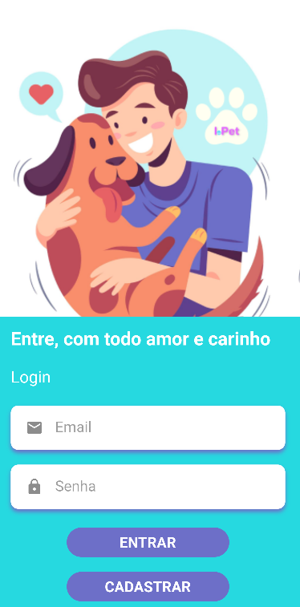
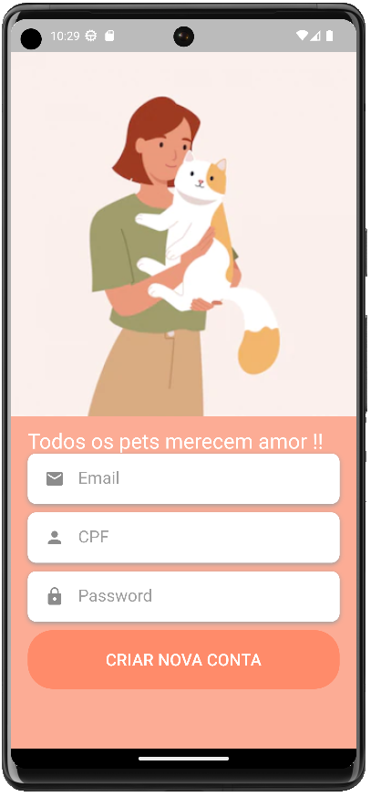
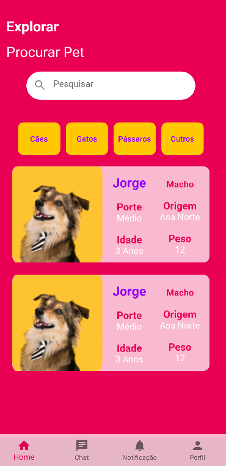
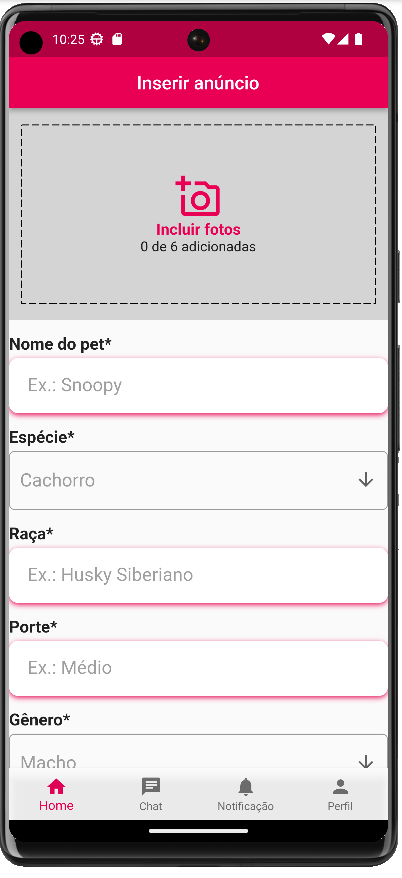

## Histórico de Versão
| Versão | Data | Modificação | Autor(es) | Revisores |
|:-:|:-:|:-:|:-:|:-:|
| 0.1 | 27/01/2022 | Criação do documento | [Eduardo Maia](https://github.com/eduardomr) & [Klyssmann Oliveira](https://github.com/klyssmannoliveira)|[Kayro César](https://github.com/kayrocesar) & [João Durso](https://github.com/jvsdurso)  & [Nicolas Roberto](https://github.com/Nicolas-Roberto)  |
| 0.1 | 28/01/2022 | Documento de Visão de Dados | [Eduardo Maia](https://github.com/eduardomr) & [Luan Cavalcante](https://github.com/Luan-Cavalcante)|[Kayro César](https://github.com/kayrocesar) & [João Durso](https://github.com/jvsdurso)  & [Nicolas Roberto](https://github.com/Nicolas-Roberto) |

# Documento de Arquitetura de Software - DAS

## 1. Introdução

###  1.1. Finalidade

Este documento tem como objetivo explicar os aspectos gerais da arquitetura do projeto IdotPet. Ele visa mostrar as escolhas arquiteturais feitas e os padrões utilizados durante o desenvolvimento do projeto.

### 1.2. Escopo
 
Este documento tem como objetivo apresentar uma visão geral da arquitetura do sistema desenvolvido para o projeto IdotPet. Ele incluirá informações sobre os padrões de software utilizados, os componentes de software, os frameworks de desenvolvimento, os casos de uso e a persistência de dados. Ele tem como objetivo descrever tecnicamente a solução adotada, tornando o projeto manutenível e apresentando os padrões a serem seguidos ao longo do seu desenvolvimento.

## 2. Representação Arquitetural

### 2.1 Back-End

**FastAPI** é um framework web para desenvolvimento de aplicações Python rápidas e simples. Ele é baseado em outros frameworks populares como Flask e Starlette, e foi projetado para ser fácil de usar e rápido de aprender. Ele utiliza o typing do Python para fornecer inferência de tipos e validação automática de parâmetros de entrada, o que ajuda a evitar erros comuns e aumenta a segurança da aplicação.

FastAPI suporta a criação de rotas assíncronas, o que permite que a aplicação gerencie várias solicitações simultaneamente sem sobrecarregar o sistema. Ele também inclui suporte para a criação de API's GraphQL, e tem integração com bibliotecas populares de banco de dados, como SQLAlchemy e Tortoise-ORM.

Além disso, FastAPI é altamente escalável e performático, e tem uma documentação clara e completa, o que facilita a sua utilização. Ele é considerado como uma das melhores opções para desenvolvimento de API's em Python.

### 2.2 Front-End

O **Flutter** é uma ferramenta criada pelo Google que facilita o processo de desenvolvimento de aplicativos móveis para Android e iOS, oferecendo recursos úteis para os desenvolvedores. Ele é construído utilizando a linguagem Dart, também desenvolvida pelo Google e semelhante a C# e Java. É importante notar que o Flutter é um framework, ou seja, um conjunto de bibliotecas utilizadas para criar uma base para a construção de aplicativos.

### 3.3 Banco de dados

**PostgreSQL** é um sistema gerenciador de banco de dados relacional de código aberto, que armazena dados em tabelas com colunas e linhas. Ele oferece suporte a vários tipos de dados, incluindo números, textos, datas e horas, e possui funções avançadas como índices, chaves estrangeiras, gatilhos e procedimentos armazenados. Ele é conhecido por sua flexibilidade e escalabilidade e é amplamente utilizado em aplicações comerciais e governamentais. A comunicação com o banco de dados é feita por meio de SQL, e ele tem uma interface de programação de aplicativos.

## 3.1 Metas Arquiteturais e Restrições da Arquitetura
|  Restrições   | Descrição  |
| :-----------: | :--------: |
| Conectividade	| É necessário estabelecer conexão com internet para utilização do IdotPet. |
| Idioma	| O sistema deve ser desenvolvido para o idioma português do Brasil. |
| Público |	O aplicativo tem como público os adotantes, doadores de pets e voluntários de abrigos e organizações não governamentais. |
| Plataforma	| A aplicação terá suporte Android. |

## 3.2 Requisitos Não Funcionais
| Metas	| Descrição |
| :------: | :------: |
| Fácil de utilização | O usuário deve conseguir utilizar o app sem treinamento específico |
| Segurança | O aplicativo deve proteger os dados dos usuários. |
| Padronização | O aplicativo deve ser intuitivo e de fácil utilização. Com layouts semelhantes à aplicações de mídias sociais já estabelecidas. |

## 4. Visão Lógica
### 4.1. Diagrama de Pacote

<iframe height="600" width="700" src="https://unbarqdsw2022-2.github.io/2022.2_G4_IdotPet/#/modelagem/diagrama_pacotes?id=diagrama-de-pacotes-1"></iframe>

### 4.2. Diagrama de Classes

<iframe height="600" width="700" src="https://unbarqdsw2022-2.github.io/2022.2_G4_IdotPet/#/modelagem/diagrama_classe?id=diagrama-de-classe"></iframe>

### 4.3. Diagrama de Comunicação

<iframe height="600" width="700" src="https://unbarqdsw2022-2.github.io/2022.2_G4_IdotPet/#/modelagem/diagrama_comunicacao"></iframe>

### 4.4. Diagrama de Estados

<iframe height="600" width="700" src="https://unbarqdsw2022-2.github.io/2022.2_G4_IdotPet/#/modelagem/diagrama_estados?id=diagrama-de-estados-1"></iframe>

## 5. Visão de Implementação

### 5.1. Diagrama de Componentes

<iframe height="600" width="700" src="https://unbarqdsw2022-2.github.io/2022.2_G4_IdotPet/#/modelagem/diagrama_componentes?id=diagrama-de-componentes"></iframe>

## 6. Visão de Implantação

<iframe height="600" width="700" src="https://unbarqdsw2022-2.github.io/2022.2_G4_IdotPet/#/modelagem/diagrama_implantacao?id=diagrama-de-implanta%c3%a7%c3%a3o"></iframe>

## 7. Visão de Processos

### 7.1. Diagrama de Atividades

<iframe height="600" width="700" src="https://unbarqdsw2022-2.github.io/2022.2_G4_IdotPet/#/modelagem/diagrama_atividades"></iframe>

### 7.2. Diagrama de Sequência

<iframe height="600" width="700" src="https://unbarqdsw2022-2.github.io/2022.2_G4_IdotPet/#/modelagem/diagrama_sequencia"></iframe>

## 8. Visão de Dados
O Diagrama Entidade-Relacionamento (ERD) é uma representação gráfica da estrutura de dados de um sistema. É uma ferramenta importante para a modelagem conceitual de um sistema de informação, pois permite a visualização e o entendimento da estrutura lógica dos dados. A utilização de um ERD permite identificar e especificar as entidades envolvidas, as relações entre elas e os atributos dessas entidades.

O ERD ajuda a desenvolver uma visão clara e coerente do sistema, o que facilita a comunicação entre equipes, incluindo desenvolvedores, gerentes de projeto e stakeholders. Além disso, um ERD é uma base sólida para a modelagem de banco de dados e é usado como guia para a implementação do sistema.

<figcaption align="center" >Figura 1 - Diagrama Entidade-Relacionamento. Fonte : Autor</figcaption>

## 9. Tamanho e Desempenho

### 9.1. Requisitos Mínimos

    * É necessário possuir conexão com a internet;
    * Possuir smartphone com SO Andoid;
    * Para desenvolvimento possuir algum dos sistemas abaixo: 
        - Microsoft® Windows® 8/10/11 de 64 bits
        - Arquitetura de CPU x86_64; MacOS® 10.14 (Mojave) ou mais recente
        - Qualquer distribuição de Linux de 64 bits que oferece suporte para Gnome, KDE ou Unity DE e a Biblioteca C do GNU (glibc) 2.31 ou mais recente.

### 9.2. Visão Geral

O aplicativo IdotPet é projetado com uma visão geral de simplicidade e eficiência. A arquitetura MVC (Model-View-Controller) é usada no desenvolvimento do backend utilizando o framework FastAPI, garantindo que a lógica de negócios, a apresentação dos dados e as interações do usuário sejam separadas e claramente definidas. Isso torna o desenvolvimento mais fácil e organizado, além de melhorar a manutenibilidade do código.
Em resumo, a visão geral do aplicativo IdotPet é baseada na arquitetura MVC com o uso do FastAPI, arquitetura Clean Architecture com o uso do Flutter e reutilização de código, garantindo que o aplicativo seja desenvolvido de forma organizada, escalável e eficiente.

#### 9.2.1 ScreenShots da Aplicação em Execução

#### Login

 
 

#### Cadastro

 
 

#### Home

 
 

#### Cadastro de anúncio do pet

