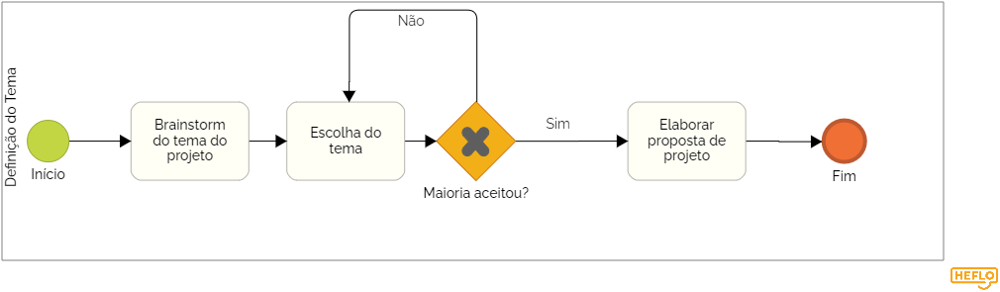
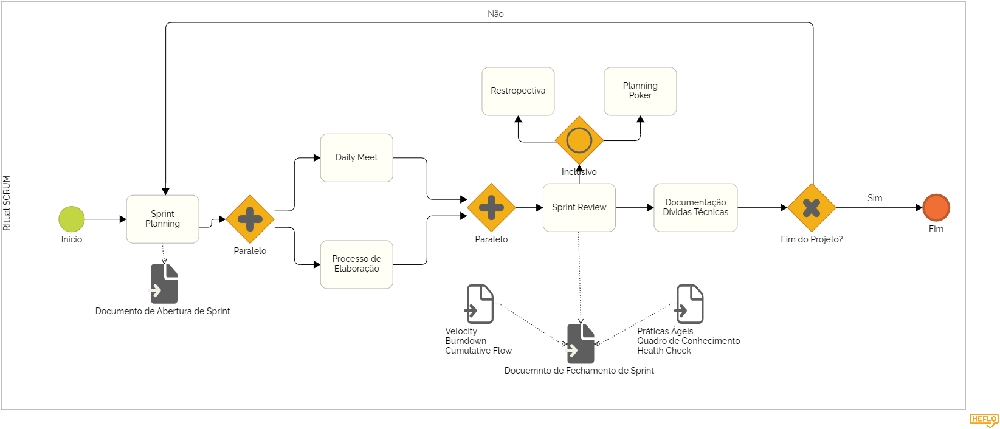
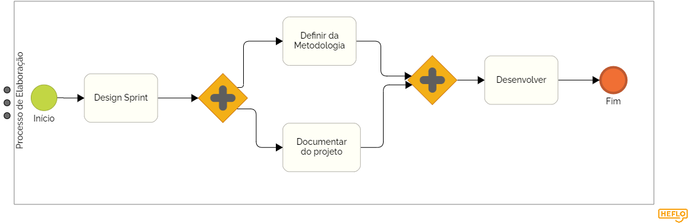
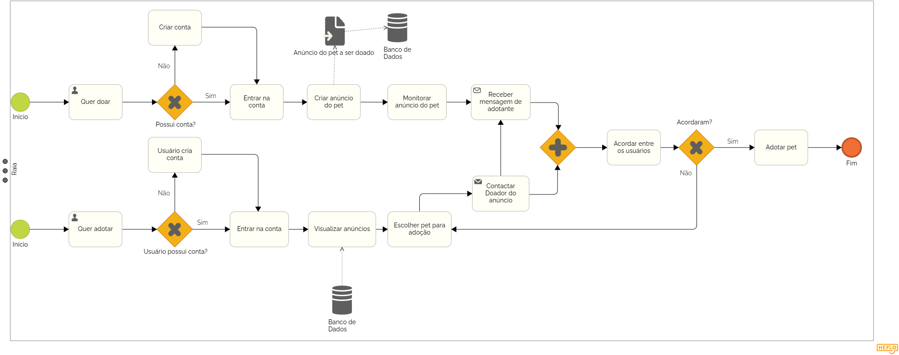

# BPMN

## Histórico de versão

| Data       | Versão | Modificação                             | Autor                                                                                                                                                                |
| :--------- | :----- | :-------------------------------------- | :------------------------------------------------------------------------------------------------------------------------------------------------------------------- |
| 16/11/2022 | 0.1    | Criação da primeira versão do documento | [@klyssmannoliveira](https://github.com/klyssmannoliveira) e [@victordscabral](https://github.com/victordscabral) e [@PedroLucasCM](https://github.com/PedroLucasCM) |
| 17/11/2022 | 0.1 | Revisão de artefato | [@eduardomr](https://github.com/@eduardomr) |

## Introdução

BPMN (Business Process Model and Notation) é uma notação gráfica que tem por objetivo prover uma gramática de símbolos para mapear, de maneira padrão, todos os processos de negócio de uma organização. Em uma representação BPMN, um processo de negócio é representado através do encadeamento de eventos e atividades, ligados através de conectores que demonstram a sequência em que os mesmos são realizados. Além de eventos e atividades, outros elementos de controle de fluxo podem ser utilizados na modelagem para permitir a criação ou unificação de fluxos paralelos que ocorram no decorrer de um mesmo processo de negócio (SGANDERLA, 2012).
Para o presente projeto, foi elaborado a representação BPMN para os processos de escolha do tema, ritual scrum, processo de elaboração e o processo básico da atividade do produto.

## Modelagem

### 1.1 Definição do Tema

  

### 1.2 Ritual SCRUM

  

### 1.3 Processo de Elaboração

  

### 1.4 Processo de Atividade do Produto

  

## Referências

SGANDERLA, Kelly. BPMN, 2012. Um guia para iniciar estudos em BPMN. Acesso em: 16 de novembro de 2022.
