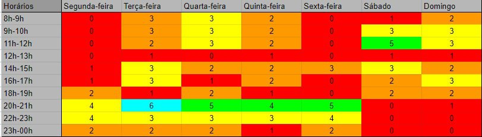

# Metodologia

## Histórico de versão

| Data       | Versão | Modificação                              | Autor                                                                                                                                                                |
| :--------- | :----- | :--------------------------------------- | :------------------------------------------------------------------------------------------------------------------------------------------------------------------- |
| 10/11/2022 | 0.1    | Criação da primeira versão do documento  | [@klyssmannoliveira](https://github.com/klyssmannoliveira) e [@victordscabral](https://github.com/victordscabral) e [@PedroLucasCM](https://github.com/PedroLucasCM) |
| 10/11/2022 | 0.2    | Mudança no endereço da imagem do heatmap | [@klyssmannoliveira](https://github.com/klyssmannoliveira) e [@victordscabral](https://github.com/victordscabral) e [@PedroLucasCM](https://github.com/PedroLucasCM) |
| 14/11/2022 | 0.3    | Revisão realizada                        | [@jvsdurso](https://github.com/jvsdurso)                                                                                                                             |
| 16/11/2022 | 0.4    | Imagem do Heatmap corrigida              | [@PedroLucasCM](https://github.com/@PedroLucasCM)                                                                                                                    |

## Introdução

Quando se fala em metodologia de desenvolvimento de um software logo se pensa em desenvolvimento ágil. Essa ampla adoção de metodologias ágeis culminou no movimento ágil em 2001. Assim, visando um desenvolvimento mais colaborativo com equipes multidisciplinadas, este produto foi desenvolvido com base nos ritos do SCRUM.

O SCRUM é uma estrutura simples e iterativa para o gerenciamento de projetos, seguindo os principais princípios: flexibilidade dos resultados, times pequenos, revisões constantes (denominadas de sprints) e colaboração mútua.

## Papéis

### Scrum Master

- Ajudar todos do Time a entenderem a metodologia e atividades ágeis utilizadas;
- Atuação em equipe com o Product Owner;
- Dimensionamento de responsabilidades e tarefas;
- Documentar cada Sprint;
- Auxiliar a equipe na melhor forma da solução de um problema, removendo impedimentos no desenvolvimento do projeto.

### Product Owner

- Responsável pelo gerenciamento do Backlog do Produto e por garantir o valor do trabalho realizado pelo Time;
- Manter o contato com o cliente;
- Assegurar que os Desenvolvedores entendam o Backlog do produto;
- Mostrar a visão do produto em um documento.

### Arquiteto

- Análise do escopo;
- Desenhar e diagramar a Arquitetura do produto;
- Alinhar as orientações com o DevOps;
- Construir o ambiente de desenvolvimento;
- Acompanhar a equipe de desenvolvimento visando ao cumprimento de cada tarefa.

### DevOps

- Controle de qualidade dos arquivos de desenvolvimento;
- Auxiliar no desenho e diagramação da Arquitetura;
- Gerenciar o Pull Request dos códigos.

### Desenvolvedores

- Desenvolver os itens definido pelo DevOps e Arquiteto;
- Entregar cada tarefa atribuída em cada Sprint;
- Pesquisar/estudar as tecnologias adotas no desenvolvimento do projeto.

## Atividades da Metodologia

O presente documento tem como objetivo elicitar as ferramentas utilizadas para poder cumprir os ritos do SCRUM.

### Sprint

- É o período determinado pela equipe para a definição e realização das tarefas;
- Duração de uma semana com início toda terça-feira;
- É documentado pelos arquivos de abertura e fechamento das sprints.

### Planejamento da Sprint

- Reuniões entre o Scrum Master e o Product Owner para o planejamento das tarefas e atividades (issues);
- Definição do pareamento da equipe para a elaboração das tarefas em conjunto.

### Revisão da Sprint

- Reunião com toda a equipe para a revisão do que foi entregue em cada atividade (issue);
- Verifica-se, nessa reunião, o cumprimento das atividades atribuídas para cada membro;
- Caso haja débito, observa-se o motivo e a atividade é repassada ou dividida para próxima sprint.

### Retrospectiva da Sprint

- Reunião com toda a equipe para a discussão dos pontos positivos e negativos da sprint;
- Elaboração de um plano de melhorias para os pontos negativos.

## Atividades do Extreme Programming (XP)

O XP é uma metodologia focada em agilidade de equipes e qualidade de projetos, apoiada em valores como simplicidade, comunicação e feedback.

### Pair Programming (Adaptado)

- Trata-se da elaboração de duplas para o desenvolvimento do código do programa.

- Adaptação do grupo: cada dupla fica responsável por uma atividade e uma outra dupla que inicialmente não teve contato com a atividade deve revisá-la;

### Integração contínua

- Os módulos do software são integrados diversas vezes ao dia (de trabalho);

- Todos os códigos devem passar por testes unitários até terem 100% de sucesso, facilitando a implementação da solução;

### Planning Poker

- Ferramenta para a atribuição democrática da pontuação das tarefas, ou seja, consultando todos ou a maioria dos membros da equipe;

### Daily Meeting (Adaptado)

- Reunião rápida com no máximo 15 minutos para o acompanhamento das atividades;

- Devido à agenda curta do semestre atual o daily meet neste projeto será realizado por meio de mensagens no grupo oficial de comunicação da equipe;

## Kanban

O Kanban é uma metodologia de organização das issues para melhor perfomance e produtividade da equipe.

- A equipe está utilizando o ZenHub que facilita a integração das issues criadas no Github com os gráficos de perfomance da equipe;

- Scrumban é aplicado a cada sprint, onde teremos um backlog de atividades que será acompanhado por meio de um Kanban, proporcinando um melhor gerenciamento contínua de melhorias.

## Cronograma de encontros

|  Dia   | Horário |          Integrantes           |                           Objetivo                           |
| :----: | :-----: | :----------------------------: | :----------------------------------------------------------: |
| Terças |   20h   |     Integrantes da equipe      |                   Reunião interna do time                    |
| Sábado |   10h   | Product Owners e Scrum Masters | Alinhamento de informações e definição da Sprint subsequente |

### Heatmap

  

