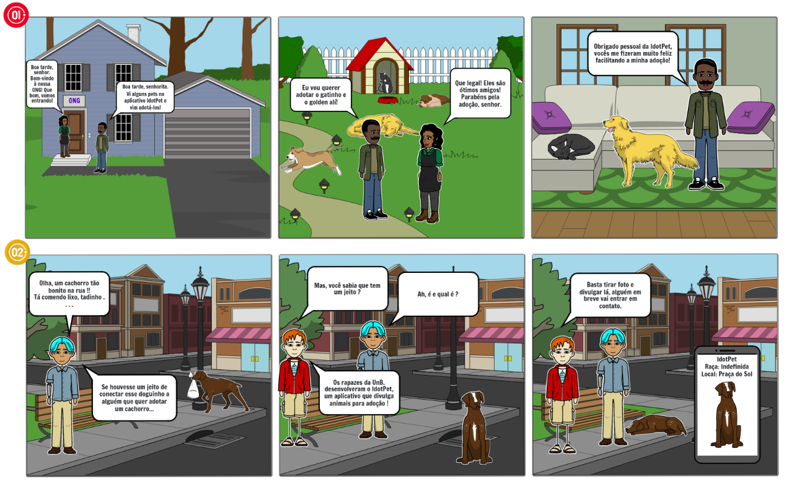
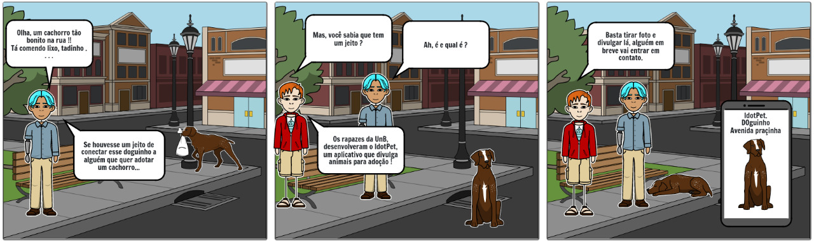

# Storyboard

## Histórico de versões
| Data | Versão | Modificação | Autor |
| :- | :- | :- | :- |
| 17/11/2022 | 0.1    | Criação e estruturação do documento | [João Durso](https://github.com/jvsdurso) & [Vitor Kühl](https://github.com/vitorekr) & [Luan Cavalcante](https://github.com/Luan-Cavalcante)| 

## Introdução

Os storyboards são uma série de ilustrações ou imagens arranjadas, com uma sequência cronológica, feitas com o objetivo de pré-visualizar um quadrinho, jogo, animação, publicidade ou alguma outra forma de mídia audiovisual. A presença do storyboard dentro do processo de criação, tanto de mídias apenas visuais, quanto audiovisuais, é fundamental. É a partir dele que a narração começa a surgir e que algumas noções de como será o produto final começam a ficar mais claras.

## Metodologia

A elaboração deste artefato foi embasada por um processo criativo, no qual os autores pesquisaram o modo de elaboração de storyboard, utilizando vídeos e sites como exemplo. Este artefato exige um conhecimento razoável em técnicas de desenho e _storytelling_, uma ferramenta de narração. A narrativa visual se constrói nessas técnicas, permitindo que as ilustrações e elementos presentes no storyboard ganhem sentido.

## Storyboard

## Versionamento do artefato

Clique para apresentar a versão 1.0 do Storyboard

 
### Storyboard v1.0
 
O Storyboard foi feito no [Storyboardthat](https://www.storyboardthat.com/pt) e não teve como restaurar todo o histórico de cada modificação. No entanto, a contribuição dessa versão foi:
- Adição da primeira linha de quadrinhos, com foco nos usuários que pretendem adotar pets e/ou divulgar pets abandonados no aplicativo IdotPet.
 

 
**Autor(es):**  
[Luan Vasco](https://github.com/Luan-Cavalcante)   

Clique para apresentar a versão 1.0 do Storyboard

 
### Storyboard v1.1
 
O Storyboard foi feito no [Storyboardthat](https://www.storyboardthat.com/pt) e não teve como restaurar todo o histórico de cada modificação. No entanto, a contribuição dessa versão foi:
- Adição da segunda linha de quadrinhos, com foco nos usuários que abrigam pets (instituições, organizações, voluntários, etc.) e também querem divulgar adoções.
 

 
**Autor(es):**  
[João Durso](https://github.com/jvsdurso)   

## Referências

> EIKO, Júlia. O que é um Storyboard?. [S. l.]: Revospace, 26 maio 2020. Disponível em: https://revospace.com.br/artigo/o-que-e-um-storyboard/. Acesso em: 17 nov. 2022.

> GUIA DO STORYBOARD PARA VÍDEOS: como, onde e por que fazer?. Disponível em: https://www.youtube.com/watch?v=Uhf4Kv-aVyM. Acesso em: Acesso em: 17 nov. 2022.