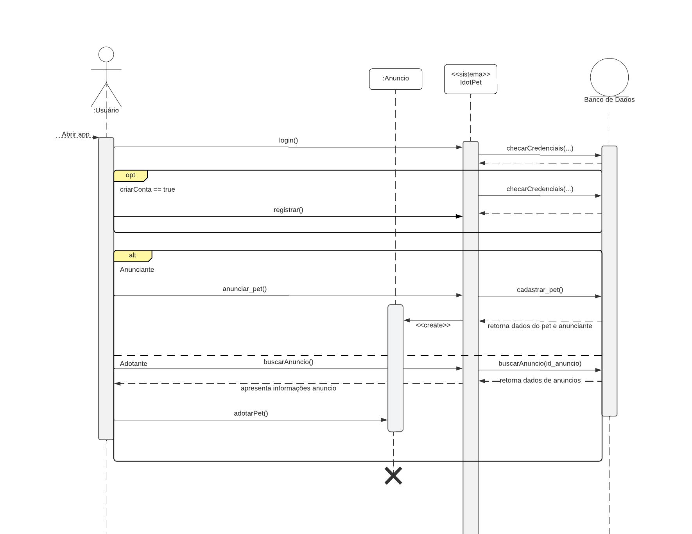

# Diagrama de Sequência

## Histórico de Versões

| Data      | Versão | Modificação                         | Autor                       |
| :-------- | :----- | :---------------------------------- | :-------------------------- |
| 02/12/2022 | 0.1    | Criação e estruturação do documento | [Eduardo Maia Rezende](https://github.com/eduardomr) & [Kayro César Silva Machado](https://github.com/kayrocesar)|
| 04/12/2022 | 0.2    | Inclusão de diagrama do projeto | [Eduardo Maia Rezende](https://github.com/eduardomr) & [Kayro César Silva Machado](https://github.com/kayrocesar)|
| 04/12/2022 | 0.3    | Correção gramatical | [Thalisson Alves](https://github.com/Thalisson-Alves)|
| 29/01/2023 | 0.4   | Correção do diagrama | [Eduardo Maia](https://github.com/eduardomr) & [Herick Lima](https://github.com/hericklima22)|

## Introdução
 Um diagrama de sequência é um tipo de diagrama de interação que descreve a ordem e como um grupo de objetos trabalha em conjunto. Geralmente, é utilizado por desenvolvedores de software e profissionais de negócios para o entendimento de necessidades de um determinado sistema ou para documentação de um processo existente.

## Benefícios

- Representação de detalhes de um caso de uso UML

- Modelagem da lógica de um processo ou operação mais complexa

- Observação da interação de objetos e componentes uns com os outros

- Útil para o planejamento e compreensão de uma funcionalidade em um cenário existente ou futuro

## Componentes e Símbolos Básicos
 

| Simbolo |  Nome  |                                  Descrição                                     |
| :-----: | :----: | :------------------------------------------------------------------------------: |
|        | Objeto | Representa uma classe ou objetos em UML |
|        | Caixa de ativação | Representa o tempo necessário para que um objeto conclua uma ação|
|        | Ator | Entidade que interage com o sistema |
|        | Pacote |Usada para conter elementos interativos do diagrama |
|        | Linha de vida |Representa a passagem do tempo, conforme segue para baixo  |
|        | Alternativo | Simboliza uma escolha entre duas ou mais sequências de mensagens  |
|        | Mensagem síncrona |   Utilizado quando um remetente deve esperar por uma resposta a uma mensagem antes de poder continuar|
|        | Mensagem assíncrona |  Representa que o remetente pode continuar sem necessitar de uma resposta  |
|        |  Mensagem de retorno assíncrona | Representa o retorno de mensagem  assíncrona|
|        | Assíncrono de criar mensagem | Representa a criação de um novo objeto |
|        | Responder à mensagem | Representa respostas às chamadas  |
|        | Excluir mensagem | Representa a destruição de um objeto |

## Metodologia 
A partir de reuniões realizadas entre a equipe do projeto foram identificadas as interações entre os objetos do sistema. Após isto, o diagrama de sequência foi elaborado, com o intuito de mapear a jornada do usuário ao utilizar o produto que será desenvolvido, assim pudemos obter uma visão geral de alto nível das funcionalidades específicas do produto.
 

## Diagrama de Sequência

  
  <figcaption align="center" >Figura 1 - Diagrama de Sequência (Versão Atual). Fonte: Autores </figcaption>

  

    
Clique para apresentar versão anterior do diagrama

    
    <figcaption align="center" >Figura 1 - Diagrama de Sequência (Versão Anterior). Fonte: Autores </figcaption>
  

## Referências

> LUCIDCHART. O que é um diagrama de sequência UML? Disponível em: https://www.lucidchart.com/pages/pt/o-que-e-diagrama-de-sequencia-uml. Acesso em: 02 de dez. de 2022.

> Modelo de Diagrama de Sequência UML Online | Exemplo editável. Disponível em: <https://miro.com/pt/modelos/diagrama-sequencia-uml/>. Acesso em: 4 dez. 2022.

> Tutorial do Diagrama de Sequência: Guia completo com exemplos. Disponível em: <https://creately.com/blog/pt/diagrama/tutorial-do-diagrama-de-sequencia/>.

‌
‌
