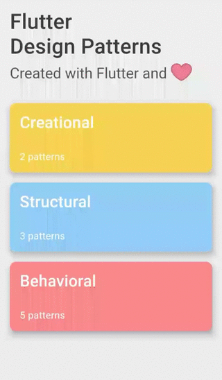
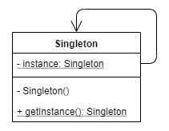

# GoF - Criacionais

## Histórico de Versões

| Data | Versão | Modificação | Autor |
| :- | :- | :- | :- |
| 04/01/2023 | 0.1 | Criação da estrutura | [Klyssmann Oliveira](https://github.com/klyssmannoliveira)|
| 04/01/2023 | 0.2 | Introdução | [João Durso](https://github.com/jvsdurso) & [Klyssmann Oliveira](https://github.com/klyssmannoliveira) |
| 04/01/2023 | 0.3 | Metodologia | [Eduardo Maia Rezende](https://github.com/eduardomr), [Pedro Cassiano](https://github.com/PedroLucasCM) & [Victor Cabral](https://github.com/victordscabral)|
| 04/01/2023 | 0.4 | Melhoria na introdução | [João Durso](https://github.com/jvsdurso), [Klyssmann Oliveira](https://github.com/klyssmannoliveira), [Eduardo Maia Rezende](https://github.com/eduardomr), [Pedro Cassiano](https://github.com/PedroLucasCM) & [Victor Cabral](https://github.com/victordscabral) |
| 04/01/2023 | 0.5 | Builder | [Klyssmann Oliveira](https://github.com/klyssmannoliveira) & [Vitor Eduardo](https://github.com/vitorekr) |
| 04/01/2023 | 0.6 | Factory, Abstract Factory e Singleton | [Klyssmann Oliveira](https://github.com/klyssmannoliveira), [Pedro Cassiano](https://github.com/PedroLucasCM) & [Victor Cabral](https://github.com/victordscabral) |
| 05/01/2023 | 0.7 | Exemplo toy Factory | [Klyssmann Oliveira](https://github.com/klyssmannoliveira) &  [Eduardo Maia Rezende](https://github.com/eduardomr) |
| 05/01/2023 | 0.8 | Exemplo toy Builder | [Klyssmann Oliveira](https://github.com/klyssmannoliveira) & [Vitor Eduardo](https://github.com/vitorekr) |

## Introdução

Os padrões de projeto GoF (Gang of Four) são uma série de padrões que fornecem uma base, modelo ou descrição de como resolver problemas frequentes durante o desenvolvimento do software. Os padrões de projeto fornecem muitos benefícios, que podem incluir:

- Fornecer um padrão geral para comunicação entre desenvolvedores;
- Reduzir o tempo ou acelerar o processo de desenvolvimento;
- Fornecer soluções comprovadas para problemas recorrentes comuns; e
- Fornecer práticas recomendadas para obter uma base de código limpa, reutilizável e sem erros.

Existem 23 padrões de projeto e estão dividividas em três categorias:

- Criacional (Tema deste documento): dizem respeito ao processo de criação de objetos;
- Estrutural: lidam com a composição de classes ou objetos; e
- Comportamental: caracterizam as maneiras pelas quais classes ou objetos interagem e distribuem responsabilidades.

Padrões de projeto criacional abstraem o processo de instanciação. Eles ajudam a tornar um sistema independente de como seus objetos são criados, compostos e representados. Um padrão de criação de classe usa herança para variar a classe que é instanciada, enquanto um padrão de criação de objeto delega a instanciação a outro objeto.

Os padrões de criação tornam-se importantes à medida que os sistemas evoluem para depender mais da composição de objetos do que da herança de classes. Quando isso acontece, a ênfase da codificação muda de um conjunto fixo de comportamentos para a definição de um conjunto menor de comportamentos fundamentais que podem ser compostos em qualquer número de comportamentos mais complexos. Desta maneira, criar objetos com comportamentos específicos requer mais do que simplesmente instanciar uma classe. 

Há dois temas recorrentes nesses padrões. Primeiro, todos eles encapsulam o conhecimento sobre quais classes concretas o sistema usa. Em segundo lugar, eles escondem como as instâncias dessas classes são criadas e reunidas. Tudo o que o sistema em geral sabe sobre os objetos são suas interfaces definidas por classes abstratas. Conseqüentemente, os padrões de criação oferecem muita flexibilidade no que é criado, quem o cria, como e quando. 

## Metodologia

Foi realizado uma reunião via ferramenta Discord, onde foi elencado os padrões mais adequados para o projeto. Em primeiro momento foi realizado um estudo do padrão e a implementação em código do projeto atual (se possível) ou de projetos similares.

## Criacional 1 - Factory

O livro da Gang of Four define o objetivo do Factory como:

> "Define uma interface para criar um objeto, mas deixa as subclasses decidirem qual classe instanciar. O Factory Method permite que uma classe adie a instanciação para subclasses."

O Factory Method define uma interface para uma classe responsável pela criação de um objeto, portanto, adiando a instanciação para classes específicas que implementam essa interface. Isso resolve o problema de criar objetos diretamente na classe que os utiliza.

Além disso, permite flexibilidade de tempo de compilação por meio de subclasses. Quando os objetos são criados dentro da classe, é muito inflexível, pois você não pode alterar a instanciação do objeto independentemente da classe — a classe está comprometida com um objeto específico. Ao implementar o padrão, as subclasses podem ser escritas para redefinir a maneira como um objeto é criado.

### Estrutura geral

<figure>
  
  <figcaption align="center" >Figura 1 - Estrutura geral factory. Fonte: DEV Community </figcaption>
</figure>

- Creator: declara o factory method, que retorna novos objetos de produto. O factory method pode ser declarado como abstrato para forçar todas as subclasses a implementá-lo. Essa classe também pode fornecer uma implementação padrão para o factory method que retorna um objeto ConcreteProduct padrão.
- ConcreteCreator: substitui o factory method para retornar uma instância de ConcreteProduct. Observe que o factory method não precisa criar uma nova instância de produto todas as vezes, por exemplo, uma instância do objeto pode ser armazenada no cache e retornada posteriormente ao chamar o factory method.
- Produt: define uma interface comum para todos os objetos criados pelo factory method.
- ConcreteProduct: implementa a interface do produto; a instância deste objeto é retornada pela classe específica ConcreteCreator.

### Aplicabilidade

O objetivo principal do padrão de projeto Factory Method é separar o código de construção do produto do código que realmente usa esse produto. Como resultado, quando há a necessidade de adicionar um novo ConcreteProduct, apenas uma nova subclasse criadora deve ser criada, substituindo o factory method. Portanto, esse padrão é uma ótima opção quando não se conhece os tipos exatos e as dependências dos objetos com os quais o código deve trabalhar.

Este método não precisa criar uma nova instância do objeto todas as vezes. Portanto, se há uma necessidade de economizar alguns recursos do sistema e reutilizar o objeto já existente em vez de reconstruí-lo, implementar o Factory Method pode ser um caminho a percorrer, por exemplo, introduzindo uma camada de cache ou armazenamento que mantém o controle de objetos já criados e retorna o objeto solicitado ao chamar o método de fábrica em uma subclasse específica do criador.

### Aplicação no idotpet

Ainda não foi aplicado no projeto.

### Aplicação com exemplo toy

Como ainda não foi possível realizar a implementação deste padrão no projeto, apresentamos então um exemplo toy. Trouxemos um exemplo em flutter do Factory Method em uma aplicação de caixa de diálogo de um app mobile que pode ser adaptado para o projeto futuramente. A Fig. 2 mostra o diagrama da implementação.

<figure>
  
  <figcaption align="center" >Figura 2 - Exemplo de Factory em flutter. Fonte: DEV Community </figcaption>
</figure>

CustomDialog é uma classe abstrata usada como classe base para todos os diálogos de alerta específicos: getTitle(), create() e show().

AndroidAlertDialog e IosAlertDialog são classes concretas que herdam da classe CustomDialog e implementam seus métodos abstratos. AndroidAlertDialog cria uma caixa de diálogo de alerta de estilo de material do tipo AlertDialog, enquanto IosAlertDialog cria uma caixa de diálogo de alerta de estilo Cupertino do tipo CupertinoAlertDialog. O Widget, CupertinoAlertDialog e AlertDialog são as classes (widgets para flutter) já implementadas da biblioteca Flutter.

FactoryMethodExample contém a classe CustomDialog para mostrar a caixa de diálogo de alerta específica desse tipo usando o método show().

Implementação do CustomDialog

~~~ dart
abstract class CustomDialog {
  String getTitle();
  Widget create (BuildContext context);

  Future<void> show(BuildContext context) async {
    var dialog = create(context);

    return showDialog<void> (
      context: context,
      barrierDimissible: false,
      builder: (BuildContext _) {
        return dialog;
      },
    );
  }
}
~~~

Implementação do Alert dialogs - AndroidAlertDialog

~~~dart
class AndroidAlertDialog extends CustomDialog {
  @override
  String getTitle() {
    return 'Android Alert Dialog';
  }

  @override
  Widget create(BuildContext context) {
    return AlertDialog(
      title: Text(getTitle()),
      content: Text('This is the material-style alert dialog!')
      actions: <Widget>[
        FlatButton(
          child: Text('Close'),
          onPressed: () {
            Navigator.of(context).pop();
          },
        )
      ],
    );
  }
}
~~~

Implementação do Alert dialogs - IosAlertDialog 

~~~ dart
class IosAlertDialog extends CustomDialog {
  @override
  String getTitle() {
    return 'iOS Alert Dialog';
  }

  @override
  Widget create(BuildContext context) {
    return CupertinoAlertDialog(
      title: Text(getTitle()),
      context: Text('This is the cupertino-style alert dialog!'),
      actions: <Widget>[
        CupertinoButton(
          child: Text('Close'),
          onPressed: () {
            Navigator.of(context).pop();
          },
        ),
      ],
    );
  }
}
~~~

Abaixo, uma animação do funcionamento do widget com flutter.

<figure>
  
  <figcaption align="center" >Figura 3 - Exemplo de Factory em flutter. Fonte: DEV Community </figcaption>
</figure>

## Criacional 2 - Builder

O livro da Gang of Four define o objetivo do builder como:

> "Separar a construção de um objeto complexo de sua representação para que o mesmo processo de construção possa criar diferentes representações."

O builder move o código de construção do objeto para fora de sua própria classe para objetos separados chamados construtores. Cada um desses construtores segue a mesma interface e implementa etapas separadas de construção de objetos. Ou seja, se o objetivo é ter uma representação diferente do objeto, basta criar uma classe construtora diferente e implementar essas etapas de construção correspondentemente. 

Além disso, há uma camada adicional no padrão de projeto Builder — Diretor. O Diretor é uma classe simples que conhece a interface do Construtor e define a ordem na qual executar as etapas de construção. Essa classe não é obrigatória, mas oculta os detalhes da construção do produto do código do cliente.

### Estrutura geral

<figure>
  
  <figcaption align="center" >Figura 4 - Estrutura geral builder. Fonte: DEV Community </figcaption>
</figure>

- Builder: define uma interface abstrata que é comum a todos os tipos de construtores para criar partes de um Produto;
- Concrete Builder: fornece uma implementação específica das etapas de construção. Além disso, define e controla o Produto que cria;
- Director: constrói um objeto usando a interface Builder, define a ordem em que as etapas de construção são chamadas;
- Produto: representa o objeto complexo em construção, expõe interface/métodos de montagem das partes no resultado final;
- Cliente: associa o objeto Construtor específico ao Diretor. Posteriormente, um objeto Product é criado chamando a instância da classe Director.

### Aplicabilidade

O padrão de projeto Builder deve ser usado quando o projeto contém vários construtores da mesma classe fazendo referência uns aos outros. Por exemplo, um construtor com vários parâmetros opcionais. Alguns desses parâmetros têm valores padrão, portanto, cria-se vários construtores mais curtos com menos parâmetros, mas ainda se refere ao principal. Ao usar o padrão de projeto Builder, constroi-se objetos passo a passo usando apenas as etapas realmente necessárias — você não precisa mais lidar com o problema de vários construtores com parâmetros opcionais.

O padrão de projeto Builder é útil quando o algoritmo para criar um objeto complexo deve ser independente das partes que compõem os objetos e como eles são montados. Em palavras simples, é apenas uma simples extração da lógica de criação do objeto de sua própria classe. Portanto, o algoritmo de construção pode evoluir separadamente do produto real que ele fornece, a modificação desse processo requer a alteração do código do objeto.

### Aplicação no iDotPet

Ainda não foi aplicado no projeto.

### Aplicação com exemplo toy

Como ainda não foi possível realizar a implementação deste padrão no projeto, apresentamos então um exemplo toy. Trouxemos um exemplo em flutter do Builder em uma aplicação de um app mobile para a montagem de um hamburguer. Este exemplo pode ser adaptado para o projeto futuramente. A Fig. 5 mostra o diagrama da implementação.

<figure>
  
  <figcaption align="center" >Figura 5 - Exemplo de builder em flutter. Fonte: DEV Community </figcaption>
</figure>

O ingrediente é uma classe abstrata que é usada como classe base para todas as classes de ingredientes. A classe contém alérgenos e propriedades de nome, bem como os métodos getAllergens() e getName() para retornar os valores dessas propriedades. Existem varios ingredientes, como visto na Fig. 5.

Burger é uma classe simples que representa o produto de um construtor. Ele contém a lista de ingredientes e a propriedade de preço para armazenar os valores correspondentes.

BurgerBuilderBase é uma classe abstrata que é usada como classe base para todas as classes do construtor de hambúrgueres. Ele contém propriedades de hambúrguer e preço para armazenar o produto final e seu preço correspondente.

BurgerBuilderBase também contém vários métodos abstratos que devem ser implementados nas classes de implementação específicas do construtor de hambúrguer. As classes construtoras concretas do BurgerBuilderBase pode ser vista na Fig. 5.

O BurgerMaker é uma classe diretora que gerencia o processo de construção do hambúrguer. E o BuilderExample inicializa e contém a classe BurgerMaker. Além disso, ele faz referência a todos os construtores de hambúrgueres específicos que podem ser alterados em tempo de execução usando a seleção suspensa da interface do usuário.

O exemplo de codificação é muito extenso e pode ser vista na referência DEV Community. Abaixo, há a demonstração para melhor compreensão do padrão.

<figure>
  
  <figcaption align="center" >Figura 6 - Exemplo de Builder em flutter. Fonte: DEV Community </figcaption>
</figure>

<<<<<<< HEAD
=======
### Aplicação no iDotPet
>>>>>>> b98f7d7da8858617013f39825972540ab3d3472d

## Criacional 3 - Abstract Factory

O livro da Gang of Four define o objetivo do Abstract Factory como:

> "Fornece uma interface para criar famílias de objetos relacionados ou dependentes sem especificar suas classes concretas."

O principal objetivo do padrão de projeto Abstract Factory é encapsular a criação de uma família de objetos em um objeto de fábrica separado, abstraindo assim o processo de criação do objeto. Para todas as famílias de objetos com suporte, uma interface comum para criar uma família de objetos é definida e, em seguida, uma classe de fábrica concreta é criada para implementar essa interface.

### Estrutura geral

<figure>
  
  <figcaption align="center" >Figura 7 - Estrutura geral abstract factory. Fonte: DEV Community </figcaption>
</figure>

- Abstract Factory: declara uma interface de operações que cria objetos abstratos do Produto;
- Concrete Factory: implementa as operações para criar objetos Concrete Product. Cada Concrete Factory corresponde apenas a uma única variante de produtos;
- Product: declara uma interface para um tipo de objeto Produto;
- Concrete Product: implementa a interface Product e define um objeto produto a ser criado pela Concrete Factory correspondente;
- Client: usa apenas interfaces declaradas pelas classes Abstract Factory e Product.

### Aplicabilidade

O Abstract Factory deve ser considerado quando o código de um sistema precisa trabalhar com várias famílias de objetos (produtos) relacionados, mas não deve depender das classes concretas desses produtos, ou de como eles são criados, compostos e representado. O referido padrão de projeto fornece uma interface para a criação de objetos de cada classe da família de produtos. Ao utilizar esta interface ao invés de implementações concretas de objetos, a camada de representação ou o código do sistema, em geral, não deve se preocupar em criar a variante errada de um produto que não corresponda a outros objetos da família. Essa restrição é útil quando você deseja introduzir widgets/componentes de interface do usuário específicos da plataforma na camada de representação e manter a consistência em todo o sistema.

### Aplicação no iDotPet

Ainda não foi aplicado no projeto.

## Criacional 4 - Singleton

O livro da Gang of Four define o objetivo do Singleton como:

> "Certifica que uma classe tenha apenas uma instância e forneça um ponto de acesso global a ela."

A ideia principal desse padrão é tornar a própria classe responsável por rastrear sua única instância.

### Estrutura geral

<figure>
  
  <figcaption align="center" >Figura 8 - Estrutura geral singleton. Fonte: DEV Community </figcaption>
</figure>

- A classe Singleton contém a instância da propriedade estática que é uma referência à própria instância da classe;
- Esta instância só é acessível através do método estático getInstance();
- O construtor de classe é marcado como privado (pode ser protegido em outras implementações) para garantir que a classe não possa ser instanciada de fora da classe.

### Aplicabilidade

Singleton pode ser usado nos casos em que a criação da instância de uma classe é cara, por exemplo instanciar uma classe requer carregar muitos dados de fontes externas. Além disso, o padrão ajuda quando você precisa acessar o mesmo objeto repetidamente em seu código, por exemplo registrador. Singleton também pode ser usado quando algum tipo de camada de cache é necessário — a classe singleton pode verificar e gerenciar o cache na solicitação da instância.

### Aplicação no iDotPet

Ainda não foi aplicado no projeto.

## Referências

> DEV Community. Design Patterns - Flutter. Disponível em: <https://dev.to/blazebrain/design-patterns-flutter-9dh>.  Acesso em: 04 jan. 2023.

> GAMMA, Erich et al. Design patterns: elements of reusable object-oriented software. Pearson Deutschland GmbH, 1995.
