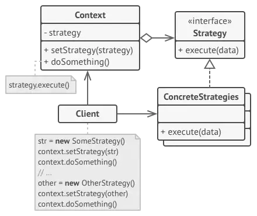
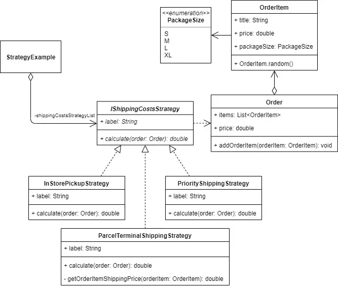
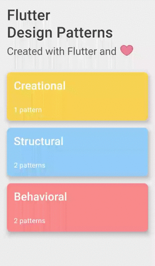
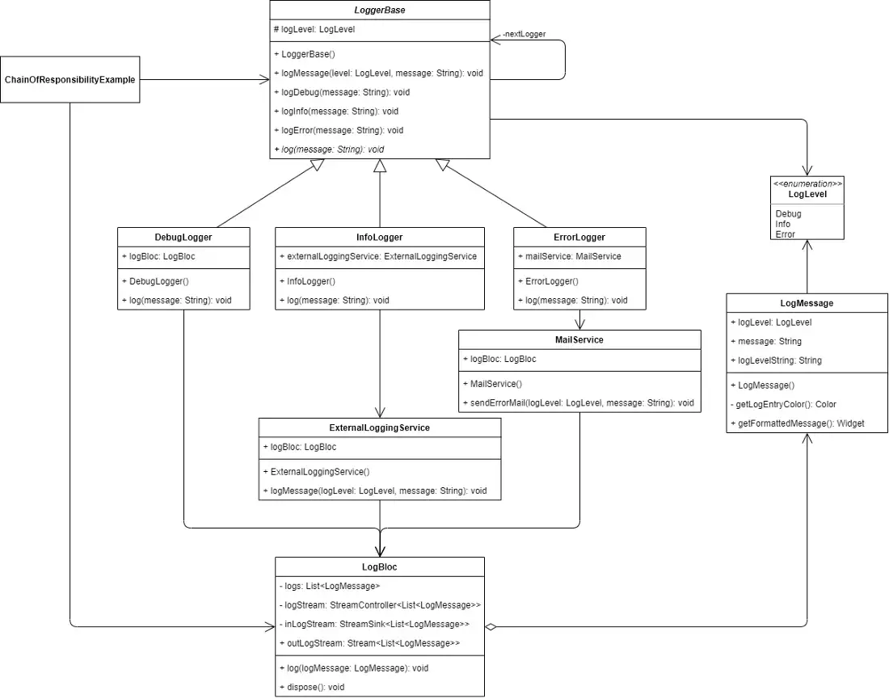
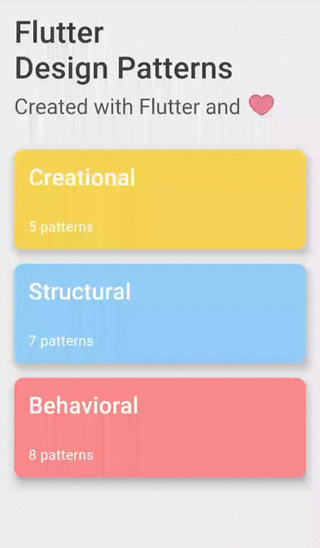
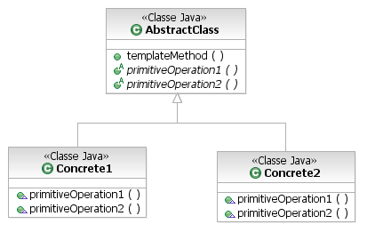
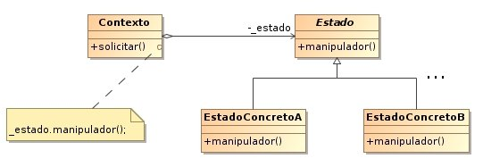
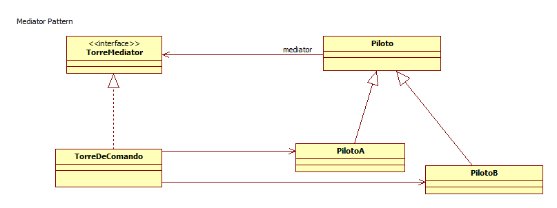

# GoFs Estruturais
## Histórico de Versões
| Data | Versão | Modificação | Autor |
| :- | :- | :- | :- |
| 05/01/2023   | 0.1   | Criação da base do documento   | [Herick Lima](https://github.com/hericklima22) & [Kayro César](https://github.com/kayrocesar)  |
| 05/01/2023   | 0.2   | Melhorias na introdução   | [Herick Lima](https://github.com/hericklima22) & [Kayro César](https://github.com/kayrocesar)  |
| 06/01/2023 | 0.3 | Exemplo Strategy | [Thalisson Alves](https://github.com/Thalisson-Alves) & [João Durso](https://github.com/jvsdurso) & [Nicolas Roberto](https://github.com/Nicolas-Roberto) |

## Introdução
Os padrões de projeto GoF (Gang of Four) são uma série de padrões que fornecem uma base, modelo ou descrição de como resolver problemas frequentes durante o desenvolvimento do software. Os padrões de projeto fornecem muitos benefícios, que podem incluir:
- Fornecer um padrão geral para comunicação entre desenvolvedores;
- Reduzir o tempo ou acelerar o processo de desenvolvimento;
- Fornecer soluções comprovadas para problemas recorrentes comuns; e
- Fornecer práticas recomendadas para obter uma base de código limpa, reutilizável e sem erros.
Existem 23 padrões de projeto e estão dividividas em três categorias:
- Criacional : dizem respeito ao processo de criação de objetos;
- Estrutural: lidam com a composição de classes ou objetos; e
- Comportamental (Tema deste documento): caracterizam as maneiras pelas quais classes ou objetos interagem e distribuem responsabilidades, ou seja, são voltados a designação de responsabilidades entre objetos.

Os padrões comportamentais são voltados para alterações no nível comportamental dos objetos do código. Auxiliam quando é necessário, por exemplo, usar vários
algoritmos diferentes, cada qual mais apropriado para um determinado contexto. Permitem, nesse caso, usar mecanismos/recursos para facilitar tanto a incorporação de novos algoritmos para novos contextos quanto a seleção de qual algoritmo usar dado um contexto.

## Metodologia
Foi realizado uma reunião via ferramenta Discord, onde foi elencado os padrões mais adequados para o projeto. Em primeiro momento foi realizado um estudo do padrão e a implementação em código do projeto atual (se possível) ou de projetos similares.

## GoFs Comportamentais

### Comportamental 1 - Strategy

#### Estrutura Geral

#### Aplicabilidade

 A ideia principal desse padrão é extrair algoritmos relacionados (ou qualquer parte do código) em classes separadas e definir uma interface comum para eles. Isso permite flexibilidade de tempo de compilação — novos algoritmos podem ser adicionados definindo novas classes e os existentes podem ser alterados independentemente.

#### Implementação no IdotPet

A implementação a seguir foi realizada no back-end da aplicação do IdotPet.

~~~python
def create_user_endpoint(user_data: OngUserScheme | UserScheme):
    if user_data.type == 'ong':
        strategy = CreateOngUserStrategy()
    else:
        strategy = CreateUserStrategy()

    return strategy.save(user_data)

class CreateOngUserStrategy:
    def save(self, ong_user_data):
        ong_user_model = OngUserModel(**ong_user_data.dict())
        repository = repository_factory(OngUserModel)
        repository.create(ong_user_model)
        return ong_user_data

class CreateUserStrategy:
    def save(self, user_data):
        user_model = UserModel(**user_data.dict())
        repository = repository_factory(UserModel)
        repository.create(user_model)
        return user_model
~~~

 
#### Aplicação com exemplo Toy

A seguir é apresentado um exemplo toy utilizando o Strategy com flutter

~~~ dart
  abstract class IShippingCostsStrategy{
    String label;
    double calculate(Order order);
  }
~~~

~~~ dart
   class InStorePickupStrategy  implements  IShippingCostsStrategy{
    
    @override
    String label= 'In-store pickup';

    @override
    double calculate(Order order){
      return 0.0;
    }

  }
~~~

~~~ dart
   class ParcelTerminalShippingStrategy implements  IShippingCostsStrategy{
    @override
    String label= 'Parcel terminal shipping';

    @override
    double calculate(Order order){
      return order.items.fold<double>(0.0, (sum,item) => sum + _getOrderItemShippingPrice(item),
      );
    }

   double _getOrderItemShippingPrice(OrderItem orderItem){
        switch(orderItem.packageSize){
            case PackageSize.S:
            return 1.99;
            case PackageSize.M:
            return 2.49;
            case PackageSize.L:
            return 2.99;
            case PackageSize.XL:
            return 3.49;
            default:
            throw new Exception("Unknown shipping price for the package of size '${orderItem.packageSize}'. " );
        }
   }

  }
~~~

~~~ dart
   class PriorityShippingStrategy   implements  IShippingCostsStrategy{
    
    @override
    String label= 'Priority shipping';

    @override
    double calculate(Order order){
      return 9.99;
    }

  }
~~~

~~~ dart
   class Order {
    final List<OrderItem> items = List<OrderItem>();

    double get price =>
      items.fold(0.0, (sum, orderItem) => sum + orderItem.price);
    
   void addOrderItem(OrderItem orderItem){
    items.add(orderItem);
   }

  }
~~~

~~~ dart
   class OrderItem {

    String title;
    double price;
    PackageSize packageSize;

    OrderItem.random(){
        var packageSizeList= PackageSize.values;

        title = faker.lorem.word();
        price = random.integer(100, min : 5 ) - 0.01;
        packageSize = packageSizeList[random.integer(packageSizeList.length)];
    }
  
  }
~~~
~~~ dart
   enum PackageSize {

    S,
    M,
    L,
    XL,
    
  }
~~~

O resultado final da implementação do padrão de projeto Strategy no exemplo apresentado fica assim:

### Comportamental 2 - Chain Of Responsability

 
#### Aplicabilidade

Chain of Responsibility é um padrão GOF cuja principal função é evitar a dependência entre um objeto receptor e um objeto solicitante. Consiste em uma série de objetos receptores e de objetos de solicitação, onde cada objetos de solicitação possui uma lógica interna que separa quais são tipos de objetos receptores que podem ser manipulados. O restante é passado para o próximo objetos de solicitação da cadeia. Devido a isso, é um padrão que utiliza a ideia de baixo acoplamento por permitir que outros objetos da cadeia tenham a oportunidade de tratar uma solicitação.

#### Implementação no IdotPet
Nenhuma implementação até o momento

#### Aplicação com exemplo Toy

A seguir é apresentado um exemplo toy utilizando o Chain Of Responsability com flutter.

~~~ dart
   enum LogLevel{Debug, Info, Error}

   extension LogLevelExtensions on LogLevel{
     bool operator <=(LogLevel logLevel)=> this.index <=logLevel.index;
   }
~~~

~~~ dart
   class LogMessage {
    final LogLevel logLevel;
    final String message;

    const LogMessage({
      @required this.logLevel,
      @required this.message,
    }) : assert(logLevel != null),
         assert(message != null);

    String get _logLevelString =>
       logLevel.toString().split('.').last.toUpperCase();
    
    Color _getLogEntryColor(){
      switch(logLevel){
        case LogLevel.Debug:
          return Colors.grey;
        case LogLevel.Info:
          return LogLevel.blue;
        case LogLevel.Error:
          return Colors.red;
        default:
            throw Exception("Log level '$logLevel' is not supported. ");
      }
    }

    Widget getFormattedMessage(){
      return Text(
       '$_logLevelString: $message',
        style: TextStyle(
          color: _getLogEntryColor(),
        ),
        textAlign: TextAlign.justify,
        overflow: TextOverflow.ellipsis,
        maxlines: 2,

      );
    }
  }
~~~

~~~ dart
   class LogBloc {

      final List<LogMessage> _logs= List<LogMessage>();
      final StreamController<List<LogMessage>>();

      StreamSink<List<LogMessage>> get _inLogStream => _logStream.sink;
      Stream<List<LogMessage>> get outLogStream => _logStream.stream;

      void log(LogMessage logMessage){
        _logs.add(logMessage);
        _inLogStream.add(UnmodifiableListView(_logs));

      }

      void dispose(){
        _logStream.close();
      }
  }
~~~

~~~ dart
   class ExternalLoggingService {
      final LogBloc logBloc;

      ExternalLoggingService(this.logBloc);

      void logMessage(LogLevel logLevel, String message){
        var logMessage = LogMessage(logLevel: logLevel, message: message);

        // Send log message to the external logging service

        // Log message
        logBloc.log(logMessage);
      }
  }
~~~

~~~ dart
   class MailService {
      final LogBloc logBloc;

      MailService(this.logBloc);

      void sendErrorMail(LogLevel logLevel, String message){
        var logMessage = LogMessage(logLevel: logLevel, message: message);

        // Send error mail

        // Log message
        logBloc.log(logMessage);
      }
  }
~~~

~~~ dart
  abstract class LoggerBase {
      @protected
      final LogLevel logLevel;
      final LoggerBase _nextLogger;

      const LoggerBase(this.logLevel, [this._nextLogger]);

      void LoggerMessage( LogLevel logLevel, String message){
        if(logLevel <= level){
          log(message);
        }

        if(_nextLogger != null ){
          _nextLogger.logMessage(level, message);
        }
      }

    void logDebug(String message) => logMessage(LogLevel.Debug, message);
    void logInfo(String message) => logMessage(LogLevel.Info, message);
    void logError(String message) => logMessage(LogLevel.Error, message);

    void log(String message);

  }
~~~

~~~ dart
   class DebugLogger extends LoggerBase {
      final LogBloc logBloc;

      const DebugLogger(this.logBloc, [LoggerBase nextLogger])
        : super(LogLevel.Debug,nextLogger);
      
      @override
      void log(String message){
        var logMessage = LogMessage(logLevel: logLevel, message: message);
        logBloc.log(logMessage);
      }
  }
~~~

~~~ dart
   class InfoLogger extends LoggerBase {
      
      ExternalLoggingService externalLoggingService;

      InfoLogger(LogBloc logBloc, [LoggerBase nextLogger])
          : super(LogLevel.Info,nextLogger) {
            externalLoggingService = ExternalLoggingService(logBloc);
        }
      
      @override
      void log(String message){
          externalLoggingService.logMessage(logLevel, message);
      }

  
  }
~~~

~~~ dart
   class ErrorLogger  extends LoggerBase {
      
      MailService mailService;

      ErrorLogger(LogBloc logBloc, [LoggerBase nextLogger])
          : super(LogLevel.Error,nextLogger) {
            mailService = MailService(logBloc);
        }
        
      @override
      void log(String message){
          mailService.sendErrorMail(logLevel, message);
      }
  }
~~~

O resultado final da implementação do padrão de projeto Chain of Responsability no exemplo apresentado:

### Comportamental 3 - Template Method

#### Estrutura Geral

#### Aplicabilidade

Um Template Method auxilia na definição de um algoritmo com partes do mesmo definidos por métodos abstratos. As subclasses devem se responsabilizar por estas partes abstratas, deste algoritmo, que serão implementadas, possivelmente de várias formas, ou seja, cada subclasse irá implementar à sua necessidade e oferecer um comportamento concreto construindo todo o algoritmo.

#### Implementação no IdotPet
Nenhuma implementação até o momento

### Comportamental 4 - Observer

#### Estrutura Geral

#### Aplicabilidade

O Observer é um padrão de projeto de software que define uma dependência um-para-muitos entre objetos de modo que quando um objeto muda o estado, todos seus dependentes são notificados e atualizados automaticamente. Permite que objetos interessados sejam avisados da mudança de estado ou outros eventos ocorrendo num outro objeto.

#### Implementação no IdotPet
Nenhuma implementação até o momento

### Comportamental 5 - State

#### Estrutura Geral

#### Aplicabilidade

State é um padrão de projeto de software usado quando o comportamento de um objeto muda, dependendo do seu estado. Em certas ocasiões, quando o contexto em que está a desenvolver requer um objeto que possua comportamentos diferentes dependendo de qual estado se encontra, é difícil manejar a mudança de comportamento e os estados desse objeto, tudo dentro do mesmo bloco de código. O padrão State propõe uma solução para esta complicação, criando basicamente, um objeto para cada estado possível do objeto que o chama.

#### Implementação no IdotPet
Nenhuma implementação até o momento

### Comportamental 6 - Memento

#### Estrutura Geral

#### Aplicabilidade

Memento é um padrão de projeto de software documentado no Catálogo Gang of Four, sendo considerado como um padrão comportamental. Ele permite armazenar o estado interno de um objeto em um determinando momento, para que seja possível retorná-lo a este estado, sem que isso cause problemas com o encapsulamento. Ele funciona de maneira que uma classe é responsável por salvar o estado do objeto desejado enquanto que uma outra classe fica responsável por armazenar todas essas copias (mementos). O padrão Memento é implementado se utilizando de três elementos: Originador, Armazenador e o Memento.

#### Implementação no IdotPet
Nenhuma implementação até o momento

### Comportamental 7 - Command

#### Estrutura Geral

#### Aplicabilidade

Command é um dos 11 padrões comportamentais dentre os 23 padrões de projeto de software do GOF. Na programação orientada a objeto, o command é um padrão no qual um objeto é usado para encapsular toda informação necessária para executar uma ação ou acionar um evento em um momento posterior. O Padrão Command tem como definição encapsular uma solicitação como um objeto, o que lhe permite parametrizar outros objetos com diferentes solicitações, enfileirar ou registrar solicitações e implementar recursos de cancelamento de operações. Isso inclui informações como o nome do método, o objeto que o método pertence e os valores dos parâmetros do método.

#### Implementação no IdotPet
Nenhuma implementação até o momento

### Comportamental 8 - Iterator

#### Estrutura Geral

#### Aplicabilidade

Em programação de computadores, um iterador se refere tanto ao objeto que permite ao programador percorrer um container, (uma coleção de elementos) particularmente listas,quanto ao padrão de projetos Iterator, no qual um iterador é usado para percorrer um container e acessar seus elementos. O padrão Iterator desacopla os algoritmos dos recipientes, porém em alguns casos, os algoritmos são necessariamente específicos dos containers e, portanto, não podem ser desacoplados.

#### Implementação no IdotPet
Nenhuma implementação até o momento

### Comportamental 9 - Mediator

#### Estrutura Geral

#### Aplicabilidade

É um padrão de projeto usado frequentemente quando deseja-se encapsular como os objetos interagem, ou seja, a comunicação entre os objetos é estabelecida através do Mediator. Este padrão é considerado um padrão comportamental, pois o padrão pode alterar o comportamento da aplicação (programa).O Mediator promove o fraco acoplamento ao evitar que objetos se referiram uns aos outros explicitamente.

#### Implementação no IdotPet
Nenhuma implementação até o momento

> DEV Community. Design Patterns - Flutter. Disponível em: https://dev.to/blazebrain/design-patterns-flutter-9dh. Acesso em: 04 jan. 2023.

> GAMMA, Erich et al. Design patterns: elements of reusable object-oriented software. Pearson Deutschland GmbH, 1995.

> GURU, Refactoring. Refactoring.Guru. [S. l.], 2023. Disponível em: https://refactoring.guru/. Acesso em: 4 jan. 2023.