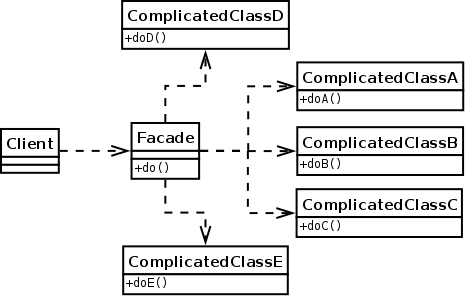
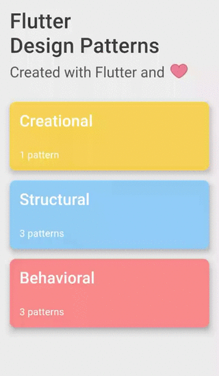
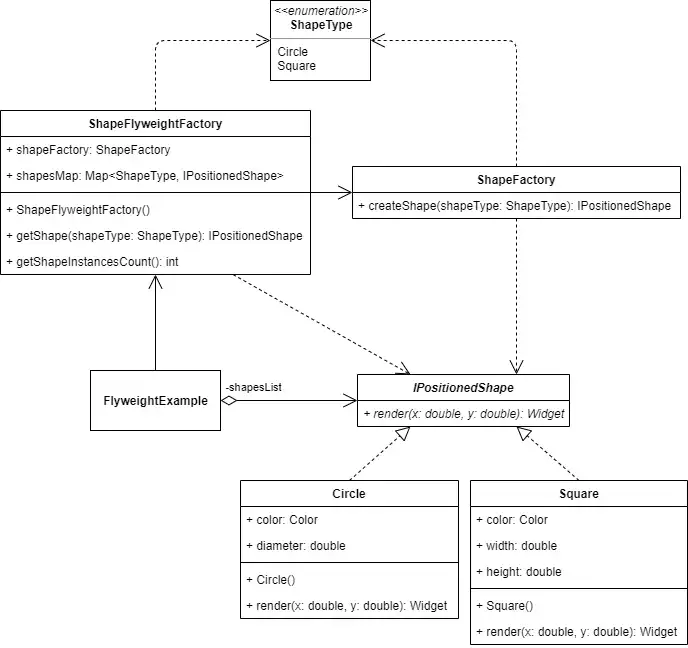
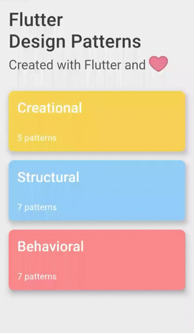
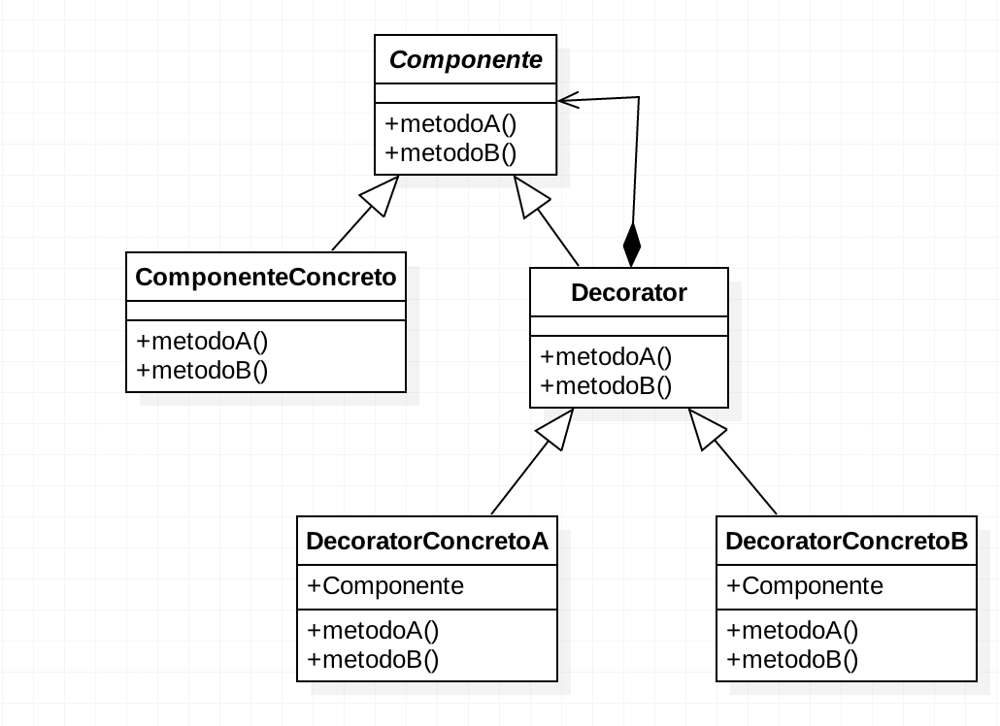

# GoFs Estruturais

## Histórico de Versões

| Data | Versão | Modificação | Autor |
| :- | :- | :- | :- |
| 02/01/2023   | 0.1   | Criação da base do documento   | [Klyssmann Oliveira](https://github.com/klyssmannoliveira) |
| 03/01/2023   | 0.2   | Preenchimento inicial do documento   | [Victor Cabral](https://github.com/victordscabral) |
| 04/01/2023   | 0.3   | Primeira parte da introdução        | [Herick Lima](https://github.com/hericklima22) & [Nicolas Roberto](https://github.com/Nicolas-Roberto) & [Kayro César](https://github.com/kayrocesar) |
| 04/01/2023   | 0.4   | Introdução completa        | [Herick Lima](https://github.com/hericklima22) & [Nicolas Roberto](https://github.com/Nicolas-Roberto) & [Kayro César](https://github.com/kayrocesar) |
| 04/01/2023   | 0.5   | Metodologia        | [Herick Lima](https://github.com/hericklima22) & [Nicolas Roberto](https://github.com/Nicolas-Roberto) & [Kayro César](https://github.com/kayrocesar) |
| 04/01/2023   | 0.6   | Terminados padrões Facade e Proxy        | [Herick Lima](https://github.com/hericklima22) & [Nicolas Roberto](https://github.com/Nicolas-Roberto) & [Kayro César](https://github.com/kayrocesar) |
| 06/01/2023   | 0.7   | Adicionado exemplo Toy Facade        | [Herick Lima](https://github.com/hericklima22) & [Nicolas Roberto](https://github.com/Nicolas-Roberto) & [Kayro César](https://github.com/kayrocesar) |
| 06/01/2023   | 0.8   | Adicionado exemplo Toy FlyWeight        | [Herick Lima](https://github.com/hericklima22) & [Nicolas Roberto](https://github.com/Nicolas-Roberto) & [Kayro César](https://github.com/kayrocesar) |

## Introdução

Os padrões de projeto GoF (Gang of Four) são uma série de padrões que fornecem uma base, modelo ou descrição de como resolver problemas frequentes durante o desenvolvimento do software. Os padrões de projeto fornecem muitos benefícios, que podem incluir:

- Fornecer um padrão geral para comunicação entre desenvolvedores;
- Reduzir o tempo ou acelerar o processo de desenvolvimento;
- Fornecer soluções comprovadas para problemas recorrentes comuns; e
- Fornecer práticas recomendadas para obter uma base de código limpa, reutilizável e sem erros.

Existem 23 padrões de projeto e estão dividividas em três categorias:

- Criacional (Tema deste documento): dizem respeito ao processo de criação de objetos;
- Estrutural: lidam com a composição de classes ou objetos; e
- Comportamental: caracterizam as maneiras pelas quais classes ou objetos interagem e distribuem responsabilidades.

Os padrões estruturais estão preocupados com a forma como as classes e os objetos são compostos a partir de estruturas maiores. Padrões de classes estruturais usam herança para compor interfaces ou implementações. Como um exemplo simples, considere como a herança múltipla mistura duas ou mais classes em uma. O resultado é uma classe que combina as propriedades de suas classes pai. Esse padrão é particularmente útil para fazer com que bibliotecas de classes desenvolvidas independentemente funcionem juntas.

## Metodologia

Foi realizado uma reunião via ferramenta Discord, onde foi elencado os padrões mais adequados para o projeto. Em primeiro momento foi realizado um estudo do padrão e a implementação em código do projeto atual (se possível) ou de projetos similares.

## GoFs Estruturais

### Estrutural 1 - Facade

O Facade é um padrão de projeto estrutural que fornece uma interface simplificada para uma biblioteca, um framework, ou qualquer conjunto complexo de classes.

#### Estrutura Geral

#### Aplicabilidade

- Tornar o código mais manutenível na medida em que as classes de visualização e negócio forem aumentando em quantidade.
- Esconder a complexidade de 03 objetos de negócio para inserir um único cliente.
- Diminuir o acoplamento entre camadas.

#### Implementação no IdotPet

Nenhuma implementação até o momento

#### Aplicação com exemplo Toy

A seguir é apresentado um exemplo toy utilizando o Facade com flutter acerca de uma API em Flutter para controle dos dispositivos de uma casa inteligente.

~~~dart
  class SmartHomeState {
    bool tvOn = false;
    bool audioSystemOn = false;
    bool netflixConnected= false;
    bool streamingCameraOn = false;
    bool gamingConsoleOn = false;
    bool lightson = true;
  }
~~~

~~~dart
  class SmartHome Facade {
    final AudioApi _audioApi = AudioApi();
    final NetflixApi _netflixApi = NetflixApi();
    final SmartHomeApi _smartHomeApi = SmartHomeApi();

    void startMovie (SmartHomeState smartHomeState, String movieTitle) {
      smartHomeState.lightson = _smartHomeApi.turnLightsOff();
      smartHomeState.tvon = _tvApi.turnon();
      smartHomeState.audioSystemOn = _audioApi.turnSpeakersOn();
      smartHomeState.netflixConnected = _netflixApi.connect();
    }

    void stopMovie (SmartHomeState smartHomeState) {
      smartHomeState.netflixConnected = _netflixApi.disconnect();
      smartHomeState.tvon = _tvApi.turnOff();
      smartHomeState.audioSystemOn = _audioApi.turnSpeakersOff();
      smartHomeState.lightson = _smartHomeApi.turnLightsOn();
    }

    void startGaming (SmartHomeState smartHomeState) {
      smartHomeState.lightson = _smartHomeApi.turnLightsOff();
      smartHomeState.tvon = _tvApi.turnon();
      _gamingFacade.startGaming (smartHomeState);
      _netflixApi.play (movieTitle);
    }

    void stopGaming (SmartHomeState smartHomeState) {
      _gamingFacade.stopGaming (smartHomeState);
      smartHomeState.tvon = _tvApi.turnOff();
      smartHomeState.lightson = _smartHomeApi.turnLightson();
    }

    void startStreaming (SmartHomeState smartHomeState) {
      smartHomeState.lightson = _smartHomeApi.turnLightson();
      smartHomeState.tvon = _tvApi.turnon();
      _gamingFacade.startStreaming (smartHomeState);
    }
    
    void stopStreaming (SmartHomeState smartHomeState) {
      _gamingFacade.stopStreaming (smartHomeState);
      smartHomeState.tvon = _tvApi.turnOff();
      smartHomeState.lightson = _smartHomeApi.turnLightson();
    }
  }
~~~

O resultado final da implementação do padrão de projeto Facade no exemplo apresentado fica assim:

### Estrutural 2 - Proxy

Proxy é um padrão de design estrutural que permite fornecer um substituto ou espaço reservado para outro objeto. Um proxy controla o acesso ao objeto original, permitindo que você execute algo antes ou depois que a solicitação chega ao objeto original.

#### Estrutura Geral

#### Aplicabilidade

O padrão Proxy sugere que você crie uma nova classe de proxy com a mesma interface que um objeto de serviço original. Em seguida, você atualiza seu aplicativo para que ele transmita o objeto proxy para todos os clientes do objeto original. Ao receber uma solicitação de um cliente, o proxy cria um objeto de serviço real e delega todo o trabalho para ele.

#### Implementação no IdotPet

### Estrutural 3 - Bridge
O Bridge é um padrão de projeto estrutural que permite que seja dividida uma classe grande ou um conjunto de classes intimamente ligadas em duas hierarquias separadas—abstração e implementação—que podem ser desenvolvidas independentemente umas das outras.
#### Estrutura Geral

#### Aplicabilidade

A Abstração nesse modelo nada mais é do que a interface que o cliente usa para interagir com a abstração do mundo real e que é implementada pela Abstração Concreta. Nessa abstração concreta é mantido uma referência a uma interface de um Implementador e é exatamente o que torna possível desacoplar a abstração da implementação porque agora a abstração faz referências a um ou mais métodos da classe implementador.

#### Implementação no IdotPet
Nenhuma implementação até o momento

### Estrutural 4 - FlyWeight
Flyweight é um padrão de design estrutural que permite ajustar mais objetos na quantidade disponível de RAM, compartilhando partes comuns do estado entre vários objetos, em vez de manter todos os dados em cada objeto.

#### Aplicabilidade
Use o padrão Flyweight quando seu programa tiver que suportar um grande número de objetos que mal cabem na RAM disponível.
#### Implementação no IdotPet
Nenhuma implementação até o momento

#### Aplicação com exemplo Toy

A seguir é apresentado um exemplo toy utilizando o FlyWeight com flutter acerca de redução de uso de memória. Vamos dizer que queremos desenhar um fundo personalizado usando duas formas geométricas diferentes, quadrados e cículos. Também queremos colocar um total de 1000 formas em posições aleatórias. Isso será implementado usando o padrão FlyWeight.

~~~dart
class ShapeFlyweightFactory {
  final ShapeFactory shapeFactory;
  final Map<ShapeType, IPositionedShape> shapesMap = Map<ShapeType, IPositionedShape>();

  ShapeFlyweightFactory({
    @required this.shapeFactory,
  }): assert(shapeFactory != null);

  IPositionedShape getShape(ShapeType shapeType) {
    if (!shapesMap.containsKey(shapeType)) {
      shapesMap[shapeType] = shapeFactory.createShape(shapeType);
    }

    return shapesMap[shapeType];
  }
  
  int getShapeInstancesCount() {
    return shapesMap.length;
  }
}
~~~

~~~dart
class FlyweightExample extends StatefulWidget {
  @override
  _FlyweightExampleState createState() => _FlyweightExampleState();
}

class _FlyweightExampleState extends State<FlyweightExample> { 
  static const int SHAPES_COUNT = 1000;

  final ShapeFactory shapeFactory = ShapeFactory();   
  
  ShapeFlyweightFactory _shapeFlyweightFactory; 
  List<IPositionedShape> _shapesList;
  int _shapeInstancesCount = 0;
  bool _useFlyweightFactory = false;

  @override
  void initState() {
    super.initState();

                            
    _shapeFlyweightFactory = ShapeFlyweightFactory(
      shapeFactory: shapeFactory,
    );

_buildShapesList();
}

void _buildShapesList() {
  var shapeInstancesCount = 0;
  _shapesList = List<IPositionedShape>();

  for (var i = 0; i < SHAPES_COUNT; i++) { 
    var shapeType = _getRandomShapeType(); 
    var shape = _useFlyweightFactory 
        ? _shapeFlyweightFactory.getShape(shapeType) 
        : shapeFactory.createShape(shapeType);

    shapeInstancesCount++; 
    _shapesList.add(shape);

  }

  setState(() {
    _shapeInstancesCount = _useFlyweightFactory
        ? _shapeFlyweightFactory.getShapeInstancesCount() 
        : shapeInstancesCount;
  });
}

ShapeType _getRandomShapeType() {
  var values = ShapeType.values;
  return values[Random().nextInt(values.length)];
}

void _toggleUseFlyweightFactory(bool value) {
  setState(() {
    _useFlyweightFactory = value;
  });

_buildShapesList();
}

@override
Widget build(BuildContext context) {
  return Stack(
    children: <Widget>[
      for (var shape in _shapesList)
        PositionedShapeWrapper( 
          shape: shape,
        ), 
      Column(
        crossAxisAlignment: CrossAxisAlignment.start,
        children: <Widget>[
          SwitchListTile.adaptive(
            title: Text(
              'Use flyweight factory', 
              style: TextStyle(
                fontWeight: FontWeight.bold,
              ),
            ),
            activeColor: Colors.black,
            value: _useFlyweightFactory,
            onChanged: _toggleUseFlyweightFactory,
          ),
        ],
      ),
      Center(
        child: Text(
          'Shape instances count: $_shapeInstancesCount', 
            style: TextStyle(
              fontWeight: FontWeight.bold,
            ),
          ),
        ),
      ],
    );
  }
}

~~~

O resultado final da implementação do padrão de projeto FlyWeight no exemplo apresentado fica assim:

### Estrutural 5 - Decorator

Decorator é um padrão de design estrutural que permite anexar novos comportamentos a objetos colocando esses objetos dentro de objetos wrapper especiais que contêm os comportamentos.
#### Estrutura Geral

#### Aplicabilidade
Use o padrão Decorator quando precisar atribuir comportamentos extras a objetos em tempo de execução sem quebrar o código que usa esses objetos ou quando for difícil ou impossível estender o comportamento de um objeto usando herança.
#### Implementação no IdotPet
Nenhuma implementação até o momento

### Estrutural 6 - Composite
Composite é um padrão de design estrutural que permite compor objetos em estruturas de árvore e depois trabalhar com essas estruturas como se fossem objetos individuais.
#### Estrutura Geral

#### Aplicabilidade
Use o padrão Composite quando precisar implementar uma estrutura de objeto semelhante a uma árvore, ou quando desejar que o código do cliente trate elementos simples e complexos de maneira uniforme.
#### Implementação no IdotPet
Nenhuma implementação até o momento

### Estrutural 7 - Adapter
O Adapter é um padrão de projeto estrutural que permite objetos com interfaces incompatíveis colaborarem entre si.
Um adaptador encobre um dos objetos para esconder a complexidade da conversão acontecendo nos bastidores. O objeto encobrido nem fica ciente do adaptador. Por exemplo, você pode encobrir um objeto que opera em metros e quilômetros com um adaptador que converte todos os dados para unidades imperiais tais como pés e milhas.

#### Estrutura Geral

#### Aplicabilidade
Utilize a classe Adaptador quando você quer usar uma classe existente, mas sua interface não for compatível com o resto do seu código.
#### Implementação no IdotPet
Nenhuma implementação até o momento

## Aplicação no Projeto

## Possível implementação em código

## Referências

> DEV Community. Design Patterns - Flutter. Disponível em: <https://dev.to/blazebrain/design-patterns-flutter-9dh>.  Acesso em: 04 jan. 2023.

> GAMMA, Erich et al. Design patterns: elements of reusable object-oriented software. Pearson Deutschland GmbH, 1995.

> GURU, Refactoring. Refactoring.Guru. [S. l.], 2023. Disponível em: https://refactoring.guru/. Acesso em: 4 jan. 2023.