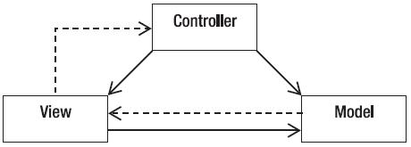
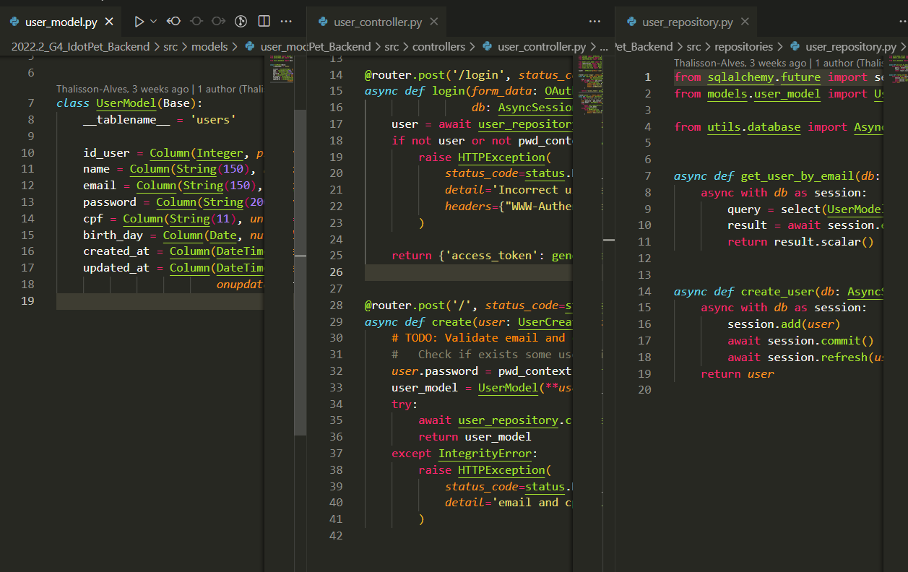
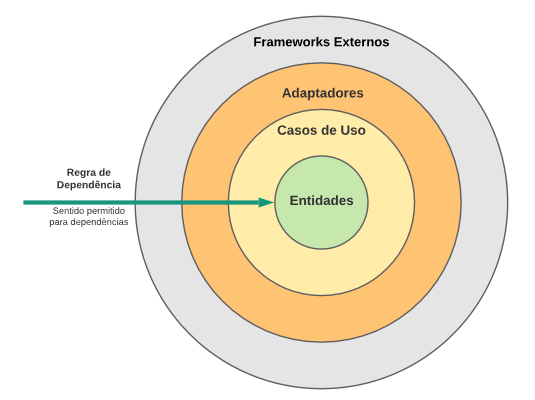

# Padrões de Projeto Emergentes

## Histórico de Versões

| Data | Versão | Modificação | Autor |
| :- | :- | :- | :- |
| 04/01/2023   | 0.1   | Criação da base do documento   | [Pedro Cassiano](https://github.com/PedroLucasCM) & [João Durso](https://github.com/jvsdurso) |
| 05/01/2023   | 0.2   | Preenchimento da Introdução   | [Pedro Cassiano](https://github.com/PedroLucasCM) & [João Durso](https://github.com/jvsdurso) |
| 06/01/2023   | 0.3   | Adição do Padrão Arquitetura Limpa   | [Pedro Cassiano](https://github.com/PedroLucasCM) |

## Introdução

Padrões de Projeto são muito importantes para o desenvolvimento de softwares orientados a objetos, pois com um se tem um processo detalhado para a organização, produção de um produto de software e tenha uma arquitetura flexível para acomodar futuros problemas e requisitos sem a necessidade da realização do re-projeto.

## Metodologia

Foi realizado uma reunião via ferramenta Discord, onde foi elencado os padrões emergentes utilizados em nosso projeto. Em primeiro momento foi realizado um estudo do padrão e a comparação em nosso projeto atual (se possível). Foi percebido o uso do padrão MVC em nosso código backend e também o Arquitetura Limpa ou Clean Architecture no frontend.

## Padrões Emergentes

### MVC

O Padrão MVC é dividida em três componentes essenciais: Model, Controller e View.
O Model é o que possui e recebe os dados do Controller, criando instâncias, armazenando elas, etc.
O Controller é o que faz as operações, que recebe os inputs e dados, se utiliza das funções para preparar os dados e enviar para o Model ou disponibilizá-las para a View.
A View é o que manda as informações para a visão do usuário, que disponibiliza a visualização dos dados.

<figure>
  
  <figcaption align="center"> Figura 1- Modelo MVC. Fonte: Higor (2013), Devmedia </figcaption>
</figure>

#### Implementação no IdotPet
No iDotPet foi-se implementado o padrão MVC no backend com o Model possuindo classes de criação de instâncias, o Controller possuindo classes de controle e funções de inputs do aplicativo, etc, e o View para disponibilizar visualmente dados do usuário. 
Cada componente possui sua própria pasta com suas próprias classes distacadas na Figura 2. A Figura 3 mostra as classes de View, Controller e Model do User.
<figure>
  
  <figcaption align="center"> Figura 2 - Pastas do padrão MVC no Projeto iDotPet. Fonte: Autores. </figcaption>
</figure>

### Arquitetura Limpa

O padrão Arquitetura Limpa (Clean Architecture) foi proposto por Robert Martin a.k.a Uncle Bob com o objetivo de promover a implementação de sistemas que favorecem reusabilidade de código, coesão, independência de tecnologia e testabilidade. Muita representada pela imagem da Figura 1 pois explica bem a organização desse padrão que é dividida em Entidade, Casos de Uso, Adaptadores, Frameworks Externos e cada uma encapsula a anterior.
- Entidades são as classes e objetos do projeto;
- Casos de uso são as implementaç~eos das regras de negócios;
- Adaptadores são as classes que fazem um mediação entre as camadas internas e a camada externa. Por exemplo,
se o sistema usa REST API a camada adaptadora seria das classes que utilizariam os métodos REST.
- Frameworks Externos são o que a classe diz ser, frameworks, bibliotecas, que cuidam de interfaces com usuários, envio de emails, notificação, comunicação com terceiros, etc.

O principal é que nenhuma classe de uma camada se comunica com outra externa, porém uma camada externa pode utilizar de objetos de uma camada interna.

<figure>
  
  <figcaption align="center"> Figura 2 - Modelo Exemplo Arquitetura Limpa. Fonte: Higor (2013), Devmedia </figcaption>
</figure>

#### Implementação no IdotPet
No iDotPet foi-se implementado o padrão de Arquitetura Limpa no frontend para aumentar a coesão, abaixar o acomplamento e separação de interesse, além da inversão de depedências, onde a camada X não pode usar outra camada externa Y.

## Referências

> Alessandro. Conheça os padrões de projeto, Devmedia, 2005. Disponível em: <https://www.devmedia.com.br/conheca-os-padroes-de-projeto/957>
> Higor. Conheça os padrões de projeto, Devmedia, 2013. Disponível em: <https://www.devmedia.com.br/introducao-ao-padrao-mvc/29308>
> ZUCHER, Vitor. O que é padrão MVC? Entenda arquitetura de softwares!, 2020. Disponível em: <https://www.lewagon.com/pt-BR/blog/o-que-e-padrao-mvc>
> VALENTE, Marco Tulio. Engenharia de Software Moderna: Princípios e Práticas para Desenvolvimento de Software com Produtividade.1 de janeiro de 2022. Independente, 408 páginas.
