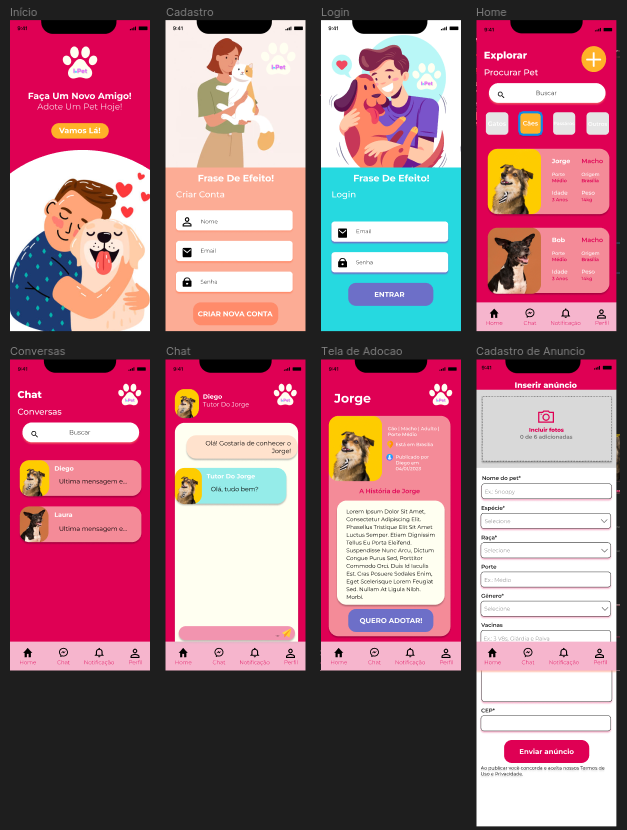
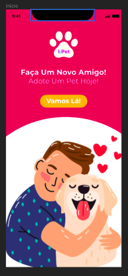
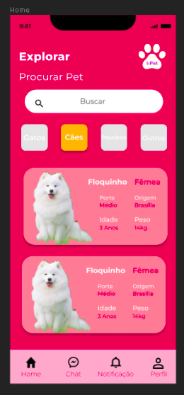
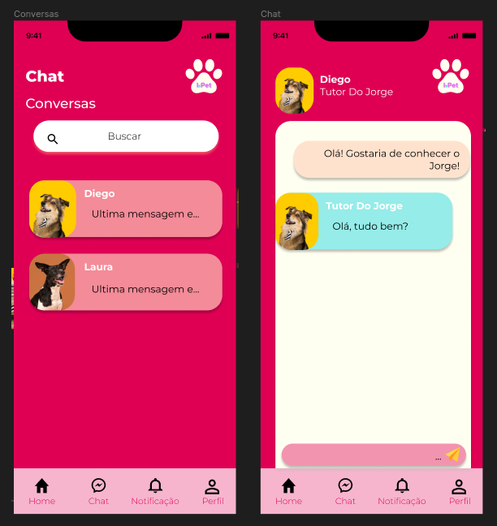
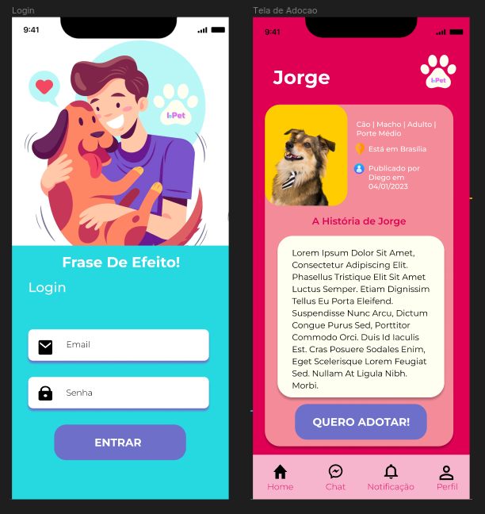
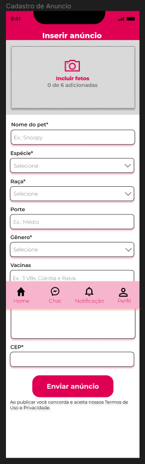

# Protótipo de Alta Fidelidade
  
## Histórico de Versões
| Data | Versão | Modificação | Autor |
| :- | :- | :- | :- |
| 02/01/2023 | 0.1    | Criação e estruturação do documento | [João Durso](https://github.com/jvsdurso) & [Eduardo Maia](https://github.com/eduardomr) & [Klyssmann Oliveira](https://github.com/klyssmannoliveira)| 
| 02/01/2023 | 0.2    | Adicionado introdução | [João Durso](https://github.com/jvsdurso) & [Eduardo Maia](https://github.com/eduardomr) & [Klyssmann Oliveira](https://github.com/klyssmannoliveira)| 
| 02/01/2023 | 0.3    | Adicionado metodologia | [João Durso](https://github.com/jvsdurso) & [Eduardo Maia](https://github.com/eduardomr) & [Klyssmann Oliveira](https://github.com/klyssmannoliveira)| 
| 02/01/2023 | 0.4    | Adicionado primeira versão completa do artefato  | [João Durso](https://github.com/jvsdurso) & [Eduardo Maia](https://github.com/eduardomr) & [Klyssmann Oliveira](https://github.com/klyssmannoliveira)| 
| 04/01/2023 | 0.5    | Adicionado segunda versão completa do artefato  | [João Durso](https://github.com/jvsdurso) & [Eduardo Maia](https://github.com/eduardomr) & [Klyssmann Oliveira](https://github.com/klyssmannoliveira)| 
| 04/01/2023 | 0.6    | Revisão do artefato  | [Thalisson Alves](https://github.com/Thalisson-Alves)| 
| 28/01/2023 | 0.7    | Adicionado terceira versão completa do artefato  | [João Durso](https://github.com/jvsdurso) & [Eduardo Maia](https://github.com/eduardomr) & [Klyssmann Oliveira](https://github.com/klyssmannoliveira)| 

## Introdução
Um protótipo de alta fidelidade é uma representação interativa do produto, baseada no computador ou em dispositivos móveis. Esse protótipo já apresenta maior semelhança com o design final em termos de detalhes e funcionalidade. Isto é, os protótipos de alta fidelidade abrangem não apenas a interface do usuário (UI) do produto em termos visuais e estéticos, mas também os aspectos da experiência do usuário (UX) em termos de interações, fluxo e comportamento.

## Metodologia
A elaboração deste artefato foi embasada por um processo criativo, no qual os autores pesquisaram o modo de elaboração do protótipo de alta fidelidade, utilizando vídeos e sites como exemplo. Em seguida, foi aberto um documento compartilhado no [Figma](https://www.figma.com/) para que a equipe pudesse trabalhar em conjunto na construção.

## Protótipo de Alta Fidelidade

<iframe style="border: 1px solid rgba(0, 0, 0, 0.1);" width="800" height="450" src="https://www.figma.com/embed?embed_host=share&url=https%3A%2F%2Fwww.figma.com%2Fproto%2FhtZeviKsRQbWM25Gnb5qgb%2FidotPet%3Fnode-id%3D1%253A2%26scaling%3Dscale-down%26page-id%3D0%253A1%26starting-point-node-id%3D1%253A2" allowfullscreen></iframe>

## Versionamento do artefato

Clique para apresentar a versão 1.0 do Protótipo de Alta Fidelidade

 
### Protótipo de Alta Fidelidade v1.0
 
O Protótipo de Alta Fidelidade foi feito no [Figma](https://www.figma.com/) e não teve como restaurar todo o histórico de cada modificação. No entanto, a contribuição dessa versão foi:
- Criação da tela de início do aplicativo.
 

 
**Autor(es):**  
[João Durso](https://github.com/jvsdurso) & [Eduardo Maia](https://github.com/eduardomr) & [Klyssmann Oliveira](https://github.com/klyssmannoliveira)   

Clique para apresentar a versão 1.1 do Protótipo de Alta Fidelidade

 
### Protótipo de Alta Fidelidade v1.1
 
O Protótipo de Alta Fidelidade foi feito no [Figma](https://www.figma.com/) e não teve como restaurar todo o histórico de cada modificação. No entanto, a contribuição dessa versão foi:
- Criação da tela de cadastro.
 

 
**Autor(es):**  
[João Durso](https://github.com/jvsdurso) & [Eduardo Maia](https://github.com/eduardomr) & [Klyssmann Oliveira](https://github.com/klyssmannoliveira)   

Clique para apresentar a versão 1.2 do Protótipo de Alta Fidelidade

### Protótipo de Alta Fidelidade v1.2
 
O Protótipo de Alta Fidelidade foi feito no [Figma](https://www.figma.com/) e não teve como restaurar todo o histórico de cada modificação. No entanto, a contribuição dessa versão foi:
- Criação da tela _Home_.
 

 
**Autor(es):**  
[João Durso](https://github.com/jvsdurso) & [Eduardo Maia](https://github.com/eduardomr) & [Klyssmann Oliveira](https://github.com/klyssmannoliveira)   

Clique para apresentar a versão 1.3 do Protótipo de Alta Fidelidade

### Protótipo de Alta Fidelidade v1.3
 
O Protótipo de Alta Fidelidade foi feito no [Figma](https://www.figma.com/) e não teve como restaurar todo o histórico de cada modificação. No entanto, a contribuição dessa versão foi:
- Criação da tela de Conversas.
- Criação da tela de Chat.
 

 
**Autor(es):**  
[João Durso](https://github.com/jvsdurso) & [Eduardo Maia](https://github.com/eduardomr) & [Klyssmann Oliveira](https://github.com/klyssmannoliveira)   

Clique para apresentar a versão 1.4 do Protótipo de Alta Fidelidade

### Protótipo de Alta Fidelidade v1.4
 
O Protótipo de Alta Fidelidade foi feito no [Figma](https://www.figma.com/) e não teve como restaurar todo o histórico de cada modificação. No entanto, a contribuição dessa versão foi:
- Criação da tela de Adoção.
- Criação da tela de Login.
 

 
**Autor(es):**  
[João Durso](https://github.com/jvsdurso) & [Eduardo Maia](https://github.com/eduardomr) & [Klyssmann Oliveira](https://github.com/klyssmannoliveira)   

Clique para apresentar a versão 1.5 do Protótipo de Alta Fidelidade

### Protótipo de Alta Fidelidade v1.5
 
O Protótipo de Alta Fidelidade foi feito no [Figma](https://www.figma.com/) e não teve como restaurar todo o histórico de cada modificação. No entanto, a contribuição dessa versão foi:
- Criação da tela de Cadastro de Anúncios.
 

 
**Autor(es):**  
[João Durso](https://github.com/jvsdurso) & [Eduardo Maia](https://github.com/eduardomr) & [Klyssmann Oliveira](https://github.com/klyssmannoliveira)   

## Referências

> TERA. Prototipagem de alta fidelidade: o que é, quando, por que e como usar?. [S. l.]: Medium, 23 mar. 2020. Disponível em: https://medium.com/somos-tera/prototipagem-de-alta-fidelidade-635d745b662b. Acesso em: 1 jan. 2023.

> Food App Design | UX/UI ( Wireframe, Prototype, Export). Disponível em: https://www.youtube.com/watch?v=195RY7jCuZg. Acesso em: 1 jan. 2023.

